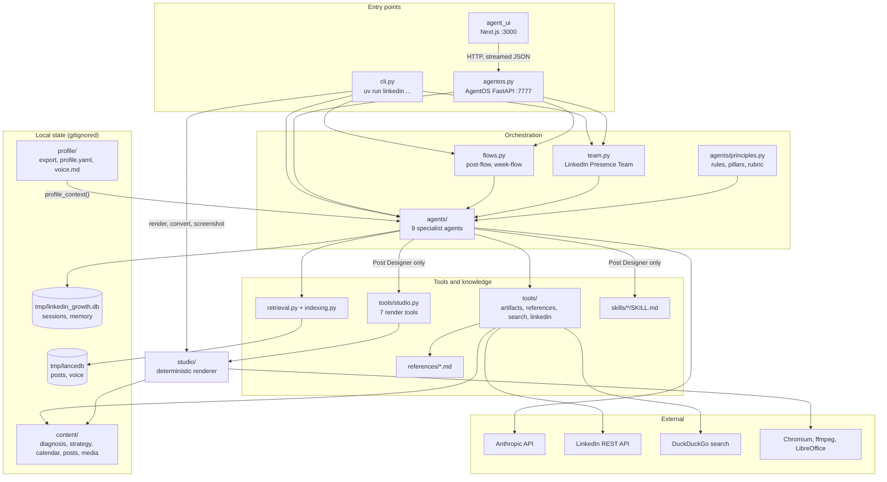
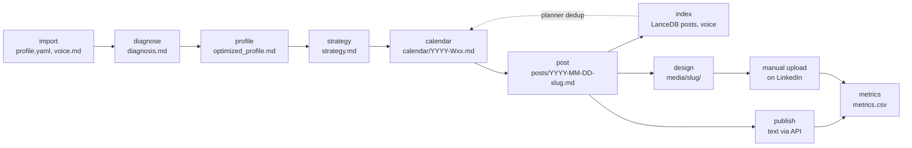
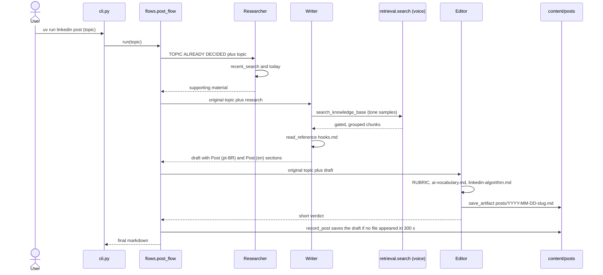
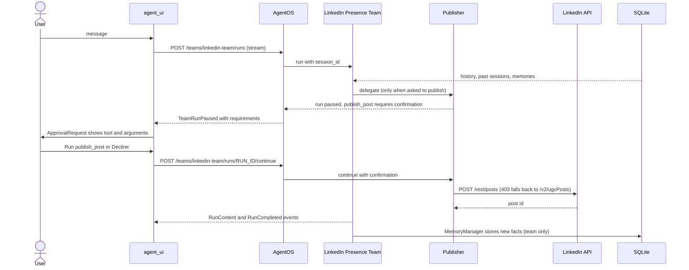
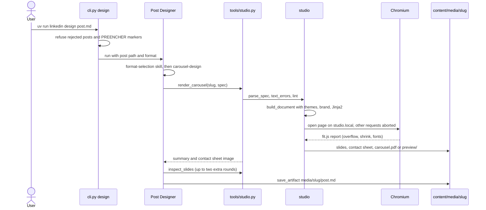
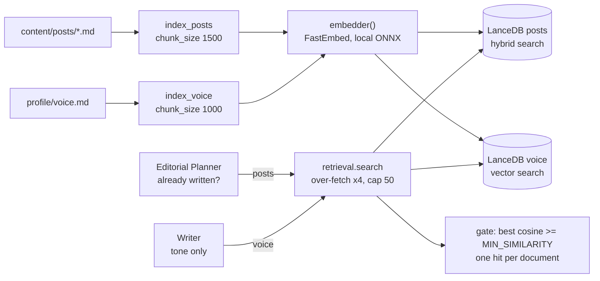

# Codebase Map

> Auto-generated by Cartographer. Last mapped: 2026-09-14T18:02:22Z (commit `91fda78`). Covers the 200 tracked text files; lockfiles, fonts and gitignored local data are excluded.

## System Overview

LinkedIn Growth Agents is a Python 3.13 project built on [Agno](https://github.com/agno-agi/agno) 3. Nine Claude-backed agents diagnose a LinkedIn profile, rewrite it, plan an editorial calendar, write and edit posts in Brazilian Portuguese (with a non-literal English version), turn posts into carousels, images or videos, and publish text through LinkedIn's official API. The system is written for someone moving into AI and is instructed never to invent experience. It runs from a Typer CLI or through AgentOS (FastAPI) with a vendored Next.js chat UI. Rendering is deterministic and uses no model: YAML spec → HTML → headless Chromium → PDF, PNG or MP4.



### The content cycle

The documented order of CLI stages (README "Run the cycle", `docs/roadmap.md`):



## Directory Structure

```
linkedin-growth-agents/
├── pyproject.toml              # package linkedin-growth, `linkedin` script, pytest config
├── uv.lock, .python-version    # uv-managed, Python 3.13
├── .env.example                # every environment variable, annotated
├── .gitignore, .gitattributes  # local data out of git; LF line endings
├── .github/workflows/
│   ├── tests.yml               # uv sync --locked, uv run pytest
│   └── validate-agent-ui.yml   # pnpm run validate in agent_ui/
├── README.md                   # setup, CLI cycle, studio, UI, memory, cost
├── docs/
│   ├── mindmap.md              # structural view (Mermaid)
│   ├── roadmap.md              # stages, product status, ideas
│   └── CODEBASE_MAP.md         # this file
├── references/                 # 6 curated knowledge files, read whole by agents
├── skills/                     # 5 Agent Skills for the Post Designer
├── src/linkedin_growth/
│   ├── config.py               # paths, env, models, SQLite, embedder, LanceDB, memory
│   ├── cli.py                  # Typer CLI (every command)
│   ├── agentos.py              # AgentOS app: team, 9 agents, 2 workflows
│   ├── team.py                 # coordinate-mode Team (chat surface)
│   ├── flows.py                # post and week workflows
│   ├── indexing.py             # posts and voice into LanceDB
│   ├── retrieval.py            # thresholded, grouped knowledge search
│   ├── agents/                 # 9 agents + principles.py
│   ├── profile/                # LinkedIn export -> Profile -> prompt context
│   ├── tools/                  # artifacts, references, search, linkedin, studio
│   └── studio/                 # deterministic renderer
│       ├── templates/          # Jinja2 deck/slide/document, layouts/, CSS, fit.js
│       └── assets/fonts/       # Archivo, IBM Plex Mono (WOFF2 + OFL)
├── tests/                      # 24 test modules + conftest.py, no API calls
└── agent_ui/                   # vendored Agno agent-ui (Next.js) + approval flow

Local only (gitignored): .env, profile/ (LinkedIn export, profile.yaml,
voice.md, brand.yaml, photo), content/, tmp/ (SQLite, LanceDB, LibreOffice
profile), applications/, benchmarks/
```

## Module Guide

### Configuration

**Purpose**: One home for paths, environment variables, model factories and lazily built shared singletons.
**Entry point**: `src/linkedin_growth/config.py` (3,283 tokens), imported by nearly every module.

| Area | Names |
|------|-------|
| Paths (from `ROOT`) | `PROFILE_DIR`, `EXPORT_DIR`, `PROFILE_YAML`, `VOICE_MD`, `BRAND_YAML`, `CONTENT_DIR`, `CALENDAR_DIR`, `POSTS_DIR`, `MEDIA_DIR`, `METRICS_CSV`, `REFERENCES_DIR`, `SKILLS_DIR`, `TMP_DIR`, `DB_FILE`; `ensure_directories()` |
| Models | `MAIN_MODEL` (default `claude-opus-5`), `FAST_MODEL` (default `claude-sonnet-5`), `MAX_TOKENS` (16000); `model(model_id=None)` returns an Agno `Claude` with prompt caching on: `cache_system_prompt=True` plus Anthropic's automatic top-level `cache_control` (pinned by `tests/test_prompt_cache.py`) |
| Secrets | `require_anthropic()`, `require_linkedin()` raise `MissingConfiguration` with fix-it text |
| Storage | `db()` → `SqliteDb` at `tmp/linkedin_growth.db`; `embedder()` → local FastEmbed (ONNX); `posts_vector_db()` (LanceDB, hybrid search), `voice_vector_db()` (LanceDB, vector search); `posts_knowledge()`, `voice_knowledge()` |
| Memory | `USER_ID`, `DEFAULT_SESSION`, `agent_session(id)` → `cli-<id>`; `memory()` → `MemoryManager` on `FAST_MODEL` (add and update on, delete and clear off); `memory_params(id)` is spread into every agent |

| Environment variable | Default / use |
|----------------------|---------------|
| `ANTHROPIC_API_KEY` | required for every model call |
| `LINKEDIN_ACCESS_TOKEN`, `LINKEDIN_VERSION` | `publish`, `connection`, Publisher agent; version defaults to `202609` |
| `MAIN_MODEL`, `FAST_MODEL`, `MAX_TOKENS` | `claude-opus-5`, `claude-sonnet-5`, `16000` |
| `EMBEDDER_MODEL`, `EMBEDDER_DIMENSIONS` | `sentence-transformers/paraphrase-multilingual-MiniLM-L12-v2`, `384` |
| `MIN_SIMILARITY` | `0.26` (retrieval gate) |
| `STUDIO_BROWSER_CHANNEL` | force `chrome` or `msedge` for rendering |
| `USER_ID`, `DEFAULT_SESSION` | `user`, `main` |
| `NEXT_PUBLIC_OS_SECURITY_KEY` | optional, `agent_ui` only (seeds the auth token) |

**Dependencies**: Agno (models, db, vectordb, knowledge, memory); `agents/principles.py` through a late import inside `memory()` (avoids a circular import).
**Dependents**: everything.

### CLI

**Purpose**: Typer app registered as the `linkedin` console script (`uv run linkedin <command>`).
**Entry point**: `linkedin_growth.cli:app` in `src/linkedin_growth/cli.py` (7,691 tokens). Commands import their dependencies inside the function body.

| Command | What it does |
|---------|--------------|
| `import` | `profile.importer.import_profile()` over `profile/linkedin_export/` → `profile.yaml`, `voice.md` |
| `index [--recreate]` | `indexing.index_all()` → LanceDB `posts` and `voice` tables |
| `diagnose`, `profile`, `strategy` | run one agent through `_run_agent` (Diagnosis, Profile Writer, Strategist) |
| `calendar [--weeks N]` | `flows.week_flow()` |
| `post --topic TEXT` | `flows.post_flow()` |
| `publish FILE [--language pt\|en] [--dry-run]` | extracts the `POST_HEADING` section and calls `tools.linkedin.publish` after confirmation; refuses media captions, `status: rejected` and `[PREENCHER` markers |
| `design FILE [--format auto\|carousel\|image\|video]` | checks the post first, then runs the Post Designer |
| `render SPEC_FILE` | re-renders a hand-edited `carousel.yaml`, `image.yaml` or `video.yaml`, no model |
| `convert FILE`, `screenshot URL` | `studio.convert.convert_file`, `studio.capture.capture_url`, no model |
| `connection` | `tools.linkedin.token_profile()` |
| `metrics` | prompts for a row appended to `content/metrics.csv` |
| `chat [--session NAME]` | REPL over `team.build()`, confirms paused tool calls |
| `memory [--forget ID] [--clear]` | lists or deletes shared memories (id prefix matching) |
| `serve [--port 7777] [--host]` | `agentos.agent_os.serve(app=...)` |
| `status` | stage checklist and index freshness |

Helpers: `_run_agent` (loops on `output.is_paused` with `Confirm.ask`), `_warn_if_truncated` (reply hit `MAX_TOKENS`), `_extract_section`, `_locate_post`, `_fail`.

### AgentOS server

`src/linkedin_growth/agentos.py` (263 tokens) builds `AgentOS(id="linkedin-growth-os", name="LinkedIn Growth OS", db=db(), teams=[team.build()], agents=agents.all_agents(), workflows=flows.all_flows())` and exposes `app = agent_os.get_app()`. It calls `ensure_directories()` at import time. `tests/test_agentos.py` drives it with Starlette's `TestClient`.

### Agents

**Purpose**: nine specialists sharing one shape: module-level `ID`, `NAME`, `ROLE` and a lazy `build() -> Agent`. Instructions are assembled from `principles.py` helpers; every agent gets `**memory_params(ID)`, `additional_context=profile_context()`, `markdown=True` and a `tool_call_limit` between 8 and 40.
**Entry point**: `agents/__init__.py` → `all_agents()` (fixed order: diagnosis, profile_writer, strategist, researcher, planner, writer, editor, designer, publisher).

| Agent (file) | Model | Tools and knowledge | Writes | Tokens |
|--------------|-------|---------------------|--------|--------|
| Profile Diagnosis (`diagnosis.py`) | main | `broad_search`, `save_artifact` | `content/diagnosis.md` | 562 |
| Profile Writer (`profile_writer.py`) | main | artifacts, `read_reference` (`headline-formulas.md`) | `content/optimized_profile.md` | 688 |
| Content Strategist (`strategist.py`) | main | artifacts, references (`kb-linkedin-publicacao.md`), searches 3 past sessions | `content/strategy.md` | 1,000 |
| Researcher (`researcher.py`) | fast | `recent_search` (last week, news), `today` | nothing | 648 |
| Editorial Planner (`planner.py`) | main | artifacts, references, posts knowledge via `build_retriever` | `content/calendar/YYYY-Wxx.md` | 1,140 |
| Writer (`writer.py`) | main | `read_artifact`, references (`hooks.md`), voice knowledge via `build_retriever` | nothing (the Editor saves) | 751 |
| Editor (`editor.py`) | main | `today`, `save_artifact`, references (`ai-vocabulary.md`, `linkedin-algorithm.md`) | `content/posts/YYYY-MM-DD-<slug>.md` | 736 |
| Post Designer (`designer.py`) | main | 7 studio tools, artifacts, references, 5 Agent Skills | `content/media/<slug>/` | 1,635 |
| Publisher (`publisher.py`) | fast | `check_linkedin_connection`, artifacts, `publish_post` | a LinkedIn text post | 471 |

Diagnosis, Strategist and Planner keep 2 history runs. Researcher, Planner and Writer change behavior when the prompt contains `TOPIC ALREADY DECIDED`, which only `flows.py` sends.

**`agents/principles.py`** (4,308 tokens) is the behavior core and imports nothing from Agno:
- Constants: `HONESTY`, `POSITIONING`, `PILLARS` (Built, Broke, Understood, Read, Compared), `VOICE_RULES` (including the em dash ban), `WRITING_RULES`, `DESIGN_RULES`, `DO_NOT`, `METRICS`, `PLATFORM_LIMITS`, `POST_HEADING` (`## Post (pt-BR)`, `## Post (en)`), `MEMORY_KEEP`/`MEMORY_DISCARD`, and `RUBRIC` (7 criteria; TRUTH = 0 fails the post).
- Helpers: `base_instructions()` (every agent), `voice_instructions()`, `content_instructions()`, `design_instructions()`, `delivery_instruction(path)`, `memory_instructions()`.

### Team and workflows

| File | Purpose | Tokens |
|------|---------|--------|
| `team.py` | `build(session=None)` → `Team(id="linkedin-team", name="LinkedIn Presence Team", mode=TeamMode.coordinate)` over `all_agents()`; routing lives in the prompt (Researcher → Writer → Editor for a new post, publish only when asked); the only entity with `update_memory_on_run=True`; 5 history runs, searches 3 past sessions | 1,015 |
| `flows.py` | `post_flow()` (`research` → `writing` → `editing` → `record`) and `week_flow()` (`research` → `calendar`), built with the local `step(name, build, message)` helper; `record_post` saves the Editor's output if no file appeared in `POSTS_DIR` within 300 s; `all_flows()` | 1,450 |

### Retrieval and indexing

| File | Purpose | Tokens |
|------|---------|--------|
| `indexing.py` | `index_posts()` chunks `content/posts/*.md` (`MarkdownReader`, `chunk_size=1500`) into `posts_knowledge()`; `index_voice()` chunks `profile/voice.md` (1000) into `voice_knowledge()`; front matter becomes metadata; `upsert=True` re-embeds everything each run; `index_all()` → `IndexReport` | 1,570 |
| `retrieval.py` | `search(knowledge, query, num_documents, min_similarity)`: over-fetch (`OVERFETCH=4`, `MAX_CANDIDATES=50`), recompute cosine similarity from stored embeddings, gate on the best candidate against `MIN_SIMILARITY`, keep source ranking, one hit per document, whitelisted metadata; `build_retriever(knowledge_factory)` plugs it in as Agno's `knowledge_retriever` | 2,274 |

`references/` and `profile.yaml` are deliberately not indexed: references are read whole, the profile is injected whole.

### Profile import

| File | Purpose | Tokens |
|------|---------|--------|
| `profile/schema.py` | pydantic `Profile` (every field optional) with `Experience`, `Education`, `Certification`, `Project`, `Language`, `PastPost`; `goal` and `topics_of_interest` have defaults meant for hand editing | 744 |
| `profile/importer.py` | `import_profile(folder)` → `(Profile, Report)`; `_map_files()` matches export CSVs against `KNOWN_FILES` (strips numeric member-id suffixes); `_csv_rows()` reads whole files (multiline quoted fields), skips LinkedIn's warning preamble and BOM; `_value()` accepts English and Portuguese column names; keeps the 25 most recent posts; `save()` preserves hand-edited `goal`/`topics_of_interest`; `save_voice()` | 3,686 |
| `profile/context.py` | `load_profile()` (raises `ProfileMissing`), `render()` (pt-BR block), `voice_sample()` (≤ 4000 chars), `profile_context()` (`lru_cache`, used by every agent and the team) | 1,561 |

### Tools

**Convention**: tools never raise; they return `ERROR: ...` text so the agent can recover.

| File | Tools | Notes | Tokens |
|------|-------|-------|--------|
| `tools/artifacts.py` | `save_artifact`, `read_artifact`, `list_artifacts`, `today` | confined to `content/` by `_resolve()`; forward slashes on Windows | 913 |
| `tools/references.py` | `read_reference`, `list_references` | read-only, confined to `references/`; no write tool by design | 578 |
| `tools/search.py` | `recent_search()`, `broad_search()` | Agno `WebSearchTools` (ddgs, no key) | 193 |
| `tools/linkedin.py` | `publish_post` (`requires_confirmation=True`), `check_linkedin_connection`; plain functions `publish`, `preview`, `token_profile` | LinkedIn "little text" escaping and hashtag templates; POST `/rest/posts`, falls back to `/v2/ugcPosts` on 403 | 2,442 |
| `tools/studio.py` | `render_carousel`, `render_image_post`, `inspect_slides`, `render_video`, `capture_screenshot`, `convert_to_pdf`, `list_media` | each wrapped in `_safely()`; writes only under `content/media/<slug>/`; `preview()` downsizes PNGs (1568 px) for the vision model | 3,160 |

### Studio

**Purpose**: deterministic, model-free rendering of posts into carousels, single images, videos, screenshots and converted PDFs.
**Entry points**: `tools/studio.py` (agent) and the `render`, `convert`, `screenshot` CLI commands. Dependencies point one way, agent → tools → `studio/`; nothing in `studio/` imports agents or tools.

| File | Purpose | Tokens |
|------|---------|--------|
| `studio/spec.py` | pydantic contract: `CarouselSpec`, `VideoSpec`, 11 layout models (`LAYOUTS`), `parse_spec`, `dump_spec`, `text_errors` (blocks `[PREENCHER]` and dashes outside code) | 3,637 |
| `studio/lint.py` | soft warnings: `WORD_LIMITS`, `MAX_WORDS_PER_SLIDE=45`, `CAROUSEL_SLIDES=(5, 12)`, `CODE_MAX_LINES=14`, `CODE_MAX_COLUMNS=56` | 1,978 |
| `studio/text.py` | the four inline marks (`**strong**`, `*emphasis*`, `==marker==`, backtick code), HTML-escaped first; `word_count`, `plain` | 847 |
| `studio/safety.py` | `redact_secrets`, `check_url`, `blocked_host_reason` (LinkedIn, private IPs, DNS rebinding), `confine`, `valid_slug`, `slugify` | 2,056 |
| `studio/themes.py` | `DRAFTING` (light), `BLUEPRINT` (dark), `FONTS`, `CAROUSEL_SIZE=(1080, 1350)`, `contrast_ratio` (WCAG 4.5 text, 3.0 graphics) | 2,572 |
| `studio/brand.py` | footer identity from `profile/brand.yaml` and `profile.yaml`; `resolve_asset_path` | 742 |
| `studio/code.py` | Pygments highlighting in theme colors; secrets redacted before lexing | 1,065 |
| `studio/html.py` | `build_document`, Jinja2 with `StrictUndefined` and autoescape, virtual origin `https://studio.local`, `FIT_SCRIPT` | 2,611 |
| `studio/browser.py` | `Studio` context manager: bundled Chromium → `channel="chrome"` → `channel="msedge"`; every request routed; `run_isolated()` when an asyncio loop is running (AgentOS) | 1,434 |
| `studio/carousel.py` | `render_carousel`: slide PNGs, contact sheet, `carousel.pdf`; errors go to `preview/`; `fit_problems`, `make_contact_sheet` | 2,201 |
| `studio/video.py` | `plan()` timeline, CSS animations seeked per frame, bundled ffmpeg (`imageio-ffmpeg`) → `video.mp4`, `captions.srt`, `cover.png` | 5,345 |
| `studio/capture.py` | `capture_url()`: public-page screenshots plus a JSON provenance sidecar | 1,604 |
| `studio/convert.py` | `convert_file()`: markdown, text, code, docx, tables, HTML, PDF and images to a uniform-page PDF; Office formats through LibreOffice | 4,752 |
| `studio/templates/` | `deck`, `slide`, `document`, `images` `.html.j2`; `layouts/*.html.j2`; `studio.css`, `document.css`, `fit.js` | 9,825 |

**Render pipeline** (`render_carousel`):
1. `spec.parse_spec` validates YAML into pydantic models; shape errors and `text_errors` block the render.
2. `lint.lint` adds non-blocking warnings.
3. `brand.default_author()` and `themes.get_theme()` resolve identity and colors.
4. `html.build_document` renders `deck.html.j2` → `slide.html.j2` → `layouts/<layout>.html.j2`, with code highlighting and confined image paths.
5. `browser.Studio` opens the page; only `index.html`, `/fonts/<file>` and `/files/<token>` are served, everything else is aborted.
6. `fit.js` shrinks text to fit and reports overflow; `carousel.fit_problems` turns that report into errors and warnings.
7. Slides are screenshotted, a contact sheet is built, and `page.pdf()` writes `carousel.pdf` only if there are no errors.

**Layouts**: `cover`, `statement`, `points`, `steps`, `code`, `compare`, `metric` (requires `source`), `quote`, `image`, `diagram`, `closing`. The field reference is `skills/carousel-design/references/layouts.md`; tests check it matches `LAYOUTS` and that every example renders.

**Outputs** under `content/media/<slug>/`: `carousel.yaml`, `slides/NN.png`, `contact-sheet.png`, `carousel.pdf` (or `preview/`); `image.yaml`, `image.png`; `video.yaml`, `video.mp4`, `captions.srt`, `cover.png`; `screens/<name>.png` with `<name>.json`; converted PDFs; the `post.md` caption.

### Post Designer and Agent Skills

`agents/designer.py` passes `skills=Skills(loaders=[LocalSkills(str(SKILLS_DIR))])`. Agno adds `get_skill_instructions` and `get_skill_reference` on its own, so don't wire them by hand. `SKILL_NAMES` must match the folders in `skills/`. The work order is:
1. Read the post.
2. Pick the format with `format-selection`.
3. Build with `carousel-design`, `short-video` or `proof-screenshots`.
4. Review the contact sheet and `inspect_slides` (at most two extra rounds).
5. Write `media/<slug>/post.md` with `post-copy`.
6. Answer briefly.

It also sets `store_media=False` and `tool_call_limit=40`.

| Skill | Use | Tokens |
|-------|-----|--------|
| `format-selection` | choose carousel, image, text or video from the post's beats and proof assets | 849 |
| `carousel-design` | outline → layouts → YAML → render → review; `references/layouts.md`, `references/review-checklist.md` | 3,893 |
| `proof-screenshots` | when and how to capture real pages; two attempts, then fall back to a `quote` slide | 987 |
| `short-video` | opt-in video in scenes, readable without sound, voice only from a real recording | 697 |
| `post-copy` | caption, document title, first comment, alt text; `references/cross-platform.md` for other networks | 1,297 |

### Knowledge base (`references/`)

Read whole through `read_reference` (progressive disclosure) and never indexed. `tests/test_references.py` checks that every filename the agents cite exists.

| File | Content | Used by | Tokens |
|------|---------|---------|--------|
| `kb-visual-formats.md` | carousel, image and video evidence and specs | Designer, Planner, `principles.DESIGN_RULES`; cited in comments across `studio/` | 9,208 |
| `kb-linkedin-publicacao.md` | studies on posting day, time, frequency and format (pt-BR) | Planner, Strategist, `principles.PLATFORM_LIMITS` | 7,129 |
| `hooks.md` | 20 hook formulas mapped to the five pillars | Writer | 3,231 |
| `linkedin-algorithm.md` | per-post format checklist | Editor, `principles.WRITING_RULES` | 1,314 |
| `ai-vocabulary.md` | words and habits that read as AI-written (pt-BR) | Editor, for the VOICE criterion | 884 |
| `headline-formulas.md` | profile headline formula and antipatterns | Profile Writer | 828 |

### Web UI (`agent_ui/`)

**Purpose**: vendored copy of Agno's MIT-licensed `agent-ui` (Next.js 15, React 18, Tailwind, shadcn/ui, Zustand, nuqs), pointed at AgentOS on `http://localhost:7777` by default.
**Project-specific changes** (everything else is upstream):
- The `DeleteTeamSession` route is fixed for AgentOS 3.
- Teams load on the first `initialize()`.
- The human-in-the-loop approval flow: `ApprovalRequest.tsx`, the `RunPaused`/`RunContinued` events, the `pendingApproval` store slice and the `/continue` routes.

| File | Purpose | Tokens |
|------|---------|--------|
| `src/api/routes.ts`, `src/api/os.ts` | endpoint builders and fetch wrappers (Bearer token) | 1,331 |
| `src/types/os.ts` | `RunEvent`, `RunResponse`, `RunRequirement`, `PendingApproval`, `ChatMessage` | 1,930 |
| `src/hooks/useAIResponseStream.tsx` | POST plus an incremental parser of concatenated JSON objects (not SSE) | 1,686 |
| `src/hooks/useAIStreamHandler.tsx` | `handleStreamResponse` (`processChunk` per event) and `handleApproval` | 4,363 |
| `src/hooks/useChatActions.ts` | `initialize()`: `/health`, `/agents`, `/teams`, URL parameter reconciliation | 1,331 |
| `src/hooks/useSessionLoader.tsx` | session list and replay of `/sessions/{id}/runs` | 1,036 |
| `src/store.ts` | Zustand store; persists only `selectedEndpoint` | 1,089 |
| `src/components/chat/ChatArea/ApprovalRequest.tsx` | shows the tool name and full arguments; no default button | 1,051 |
| `src/components/chat/Sidebar/Sidebar.tsx` | endpoint, auth token, mode and entity selectors, sessions | 2,292 |
| `src/components/ui/icon/custom-icons.tsx` | inline SVG components only | 37,175 |

**Backend contract**: `GET /health`, `GET /agents`, `GET /teams`, `POST /agents/{id}/runs`, `POST /teams/{id}/runs`, `POST .../runs/{run_id}/continue`, `GET /sessions`, `GET /sessions/{id}/runs`, `DELETE /sessions/{id}`.
**Commands**: `pnpm dev` (port 3000), `pnpm run validate` (`next lint`, `prettier --check`, `tsc --noEmit`).

### Tests and CI

`uv run pytest` runs the suite without calling Anthropic or LinkedIn. `tests/conftest.py` (2,158 tokens) provides:
- `SpyModel` and `NoteTakingModel`: network-free Claude doubles.
- `no_api`: patches `model` in `config`, `team` and every agent module.
- `temp_db`, `temp_content`, `temp_references`.
- `call()`: invokes an Agno `@tool` directly.

| Test file | Pins down |
|-----------|-----------|
| `test_agent_memory.py` | agents read memory and only the Team writes it; session continuity and isolation |
| `test_agentos.py` | `TeamMode` enum; `/teams` and `/agents` payloads |
| `test_flows.py` | every workflow step receives the original request; the Editor ↔ `publish` heading contract |
| `test_principles.py` | rule invariants: pillars, 0–3 hashtags, em dash ban reaching Writer and Profile Writer, rubric, delivery |
| `test_retrieval.py` | best-candidate gate, grouping, over-fetch cap, metadata whitelist (hand-written vectors) |
| `test_importer.py`, `test_schema.py` | CSV mapping, member-id suffixes, multiline fields, schema defaults |
| `test_artifacts.py`, `test_references.py` | path confinement; no write tool for references; cited reference files exist |
| `test_linkedin_format.py` | little-text escaping, hashtag templates, payloads, post URL |
| `test_cli_memory.py`, `test_cli_studio.py` | `memory` command; `design`, `render` and `publish` gates fail before any model or browser starts |
| `test_designer.py` | skills on disk match `SKILL_NAMES`; documented layouts render; caption heading ban |
| `test_studio_spec.py`, `test_studio_lint.py`, `test_studio_text.py`, `test_studio_code.py` | spec validation, lint warnings, inline marks, highlighting |
| `test_studio_html.py`, `test_studio_safety.py`, `test_studio_themes.py` | templates under `StrictUndefined`; URL, secret and path guards; WCAG contrast and CSS variables |
| `test_studio_tools.py`, `test_studio_convert.py`, `test_studio_video_timing.py` | tool contract, converter dispatch, caption timing |
| `test_studio_render.py` | real renders; skips without a browser, and skips the Office cases without LibreOffice |

**CI**: `.github/workflows/tests.yml` runs on every push (ubuntu-latest, Python from `.python-version`, `uv sync --locked`, `uv run pytest`, no secrets). `validate-agent-ui.yml` runs on every push (pnpm 11.25.0, Node 22, `pnpm install`, `pnpm run validate`).

## Data Flow

### 1. Writing a post (`uv run linkedin post --topic ...`)



### 2. Chat with approval (web UI)

`uv run linkedin chat` goes through the same Team and handles the same pause with `Confirm.ask`.



### 3. Designing a post (`uv run linkedin design`)



### 4. Indexing and retrieval



## Conventions

- **Languages**: agent prompts and generated content are in Brazilian Portuguese, and posts also get a non-literal English version. Code, docs and tests are in English. Commit messages use Conventional Commit prefixes (`feat(studio):`, `fix(agent_ui):`, `ci:`) with Portuguese descriptions.
- **Agent modules**: `ID`, `NAME`, `ROLE` and a lazy `build()`. Behavior changes go in `principles.py`, not in agent files.
- **Delivery**: document-producing agents call `save_artifact` before answering (`delivery_instruction`) and don't repeat the document in the reply.
- **Tools**: never raise; return `ERROR: ...` text. Irreversible or public actions use `@tool(requires_confirmation=True)`.
- **Confinement**: file access goes through `_resolve()` (`artifacts.py`, `references.py`) or `safety.confine()` (studio).
- **Laziness**: expensive objects are singletons built on first call in `config.py`; CLI commands import inside the function; late imports break cycles (`config.memory()`, `brand._profile_name()`).
- **Honesty**: never invent experience. Missing facts become `[PREENCHER: ...]` placeholders, which block `publish` and `design`. No em or en dashes in generated text.
- **Memory**: agents read memory; only the Team writes it. Deleting memories is a human action (`linkedin memory`).
- **File names**: `content/posts/YYYY-MM-DD-<slug>.md` (slug of at most five lowercase words without accents), `content/calendar/YYYY-Wxx.md`, `content/media/<slug>/`.
- **Tests**: no network or API calls; model doubles come from `conftest.py`; retrieval uses hand-written vectors; render tests skip without a browser.
- **Frontend**: pnpm, Prettier (single quotes, no semicolons), shadcn/ui, `@/*` path alias, `pnpm run validate`.
- **Platform limits**: official LinkedIn API only. No scraping, session cookies, browser automation of LinkedIn, or automated connections and messages.

## Gotchas

**Agno and orchestration**
- Pass `TeamMode.coordinate`, never the string `"coordinate"`. The string passes runtime checks but breaks serialization and empties the UI's team selector (`test_agentos.py`).
- Build workflow steps with `flows.step()`, not `Step(agent=...)`. From the second step on, Agno replaces the original request with the previous step's output.
- AgentOS serves the workflows, but the UI only lists agents and teams, so `post` and `calendar` run from the CLI.
- `profile_context()` is cached per process: after editing `profile/profile.yaml`, restart `linkedin serve` or `linkedin chat`.
- Prompt caching only pays while the prompt prefix stays byte-identical between calls. Anything volatile added to instructions or `additional_context` (a timestamp, a random id) silently turns cache reads into full-price writes. After changing how prompts are assembled, check `cache_read_tokens` in a run's metrics.
- A reply that hits `MAX_TOKENS` can lose its trailing `save_artifact` call. The CLI warns; raise `MAX_TOKENS` when it does.
- Memory is keyed by `USER_ID`, not by session, so memories cross sessions.

**Retrieval**
- Changing `EMBEDDER_MODEL` requires `uv run linkedin index --recreate`; nothing enforces it. The embedder downloads about 220 MB on first use.

**Publishing**
- `publish` sends text only and refuses `content/media/<slug>/post.md`; images, PDFs and videos are uploaded by hand. Captions must never contain `## Post (pt-BR)`, because that heading is what `publish` extracts.
- The LinkedIn token lasts 60 days and cannot be refreshed automatically.
- The UI can only resume pauses caused by tool confirmation. For any other pause it tells the user to continue with `uv run linkedin chat`.

**Studio**
- `fit.js` loads every `@font-face` the page declares and fails the render (`fontsOk`) if any face does not load, so font families are named only in `themes.FONTS`. Don't go back to `document.fonts.check()` by family name: it returned true here for families that were neither declared nor installed, which is how a stale font list once passed unnoticed. `test_a_deck_whose_bundled_fonts_do_not_load_writes_no_pdf` covers this.
- A render with errors writes to `preview/` and never replaces an existing `carousel.pdf`. The next successful render deletes `preview/`.
- The browser is network-closed: only `index.html`, `/fonts/` and `/files/<token>` on `https://studio.local` are served. Screenshots re-check every request, including DNS results that point to private IPs.
- A new theme color that carries text must be added to `Theme.text_pairs()` or `graphic_pairs()`, otherwise the WCAG test never checks it.
- Jinja2 runs with `StrictUndefined`, so a template typo is a hard error rather than a blank slide.
- Office conversion needs LibreOffice. It runs with a private profile in `tmp/libreoffice-profile` so an open desktop instance can't silently swallow the job.
- Limits in `lint.py`, `themes.py` and `video.py` cite sections of `references/kb-visual-formats.md`. Update the evidence there first.

**Repository and environment**
- The README says `test_studio_render.py` is skipped on CI for lack of Chromium. `tests.yml` says it uses the runner's Google Chrome, which matches `browser.py` falling back to `channel="chrome"`. One of the two is stale.
- On Windows, `uv run` cannot sync while `linkedin serve` holds `linkedin.exe`; use `uv run --no-sync pytest`.
- `.gitattributes` forces LF line endings; without it, `prettier --check` fails on Windows checkouts.
- `applications/` and `benchmarks/` are gitignored local folders; only `.gitignore` comments describe them.

**agent_ui**
- Agent, team and session selection live in the URL (`nuqs`), separately from the Zustand store. Only `selectedEndpoint` is persisted.
- `getAllSessionsAPI` returns an empty list on any error, so a backend outage looks like "no sessions". `useSessionLoader` expects a bare array of runs.
- `agent_ui/AGENTS.md` holds Next.js-generated agent rules, not project guidance. `Sidebar/NewChatButton.tsx` appears unused because `Sidebar.tsx` defines its own.

## Navigation Guide

**To change how every agent behaves (voice, pillars, rubric, limits)**: `src/linkedin_growth/agents/principles.py`, then `tests/test_principles.py`
**To add an agent**: `agents/<name>.py` (`ID`, `NAME`, `ROLE`, `build()`), `all_agents()` in `agents/__init__.py`, a routing line in `team.py`, tests in `test_agent_memory.py` and `test_principles.py`
**To add a tool**: a `@tool` in `tools/` (confirmation for irreversible actions, `ERROR:` strings, path confinement), the agent's `tools=[...]`, a test using `conftest.call()`
**To add a CLI command**: `@app.command()` in `cli.py` with local imports and `ensure_directories()`; test with `typer.testing.CliRunner`
**To add a workflow**: `flows.py` with `step()`, register in `all_flows()`, expose through a CLI command; test like `test_flows.py`
**To tune retrieval**: `MIN_SIMILARITY`, `OVERFETCH`, `MAX_CANDIDATES` in `retrieval.py`; embedder settings in `config.py` plus `linkedin index --recreate`
**To add reference material**: a curated `.md` in `references/`, a `read_reference` instruction in the consuming agent, the filename in `test_references.py`
**To add a studio layout**: model and `LAYOUTS` in `studio/spec.py`, `templates/layouts/<name>.html.j2`, rules in `studio.css`, `WORD_LIMITS` in `lint.py`, a row and example in `skills/carousel-design/references/layouts.md`
**To add a theme**: a `Theme` in `studio/themes.py`, registered in `THEMES`
**To add an output format**: `studio/<format>.py` (result dataclass and `render_*`), a `@tool` in `tools/studio.py`, the designer's tools and work order, a skill in `skills/`
**To add a skill**: `skills/<name>/SKILL.md` (optional `references/`) and the name in `designer.SKILL_NAMES`
**To support a new file type in `convert`**: `KINDS` and a typesetter in `studio/convert.py`
**To change LinkedIn publishing (e.g. media upload)**: `tools/linkedin.py`, `publish` in `cli.py`, `tests/test_linkedin_format.py`
**To handle a new LinkedIn export file or column**: `KNOWN_FILES` and `_value()` synonyms in `profile/importer.py`, fields in `profile/schema.py`, `tests/test_importer.py`
**To add a persistent path**: `config.py` and `ensure_directories()`
**To call a new backend endpoint from the UI**: `agent_ui/src/api/routes.ts`, `src/api/os.ts`, `src/types/os.ts`, then a hook
**To handle a new stream event in the UI**: `RunEvent` in `src/types/os.ts` and `processChunk` in `src/hooks/useAIStreamHandler.tsx`
**To change CI**: `.github/workflows/`; the Python version lives only in `.python-version`
