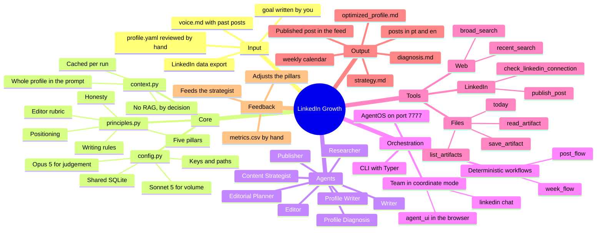
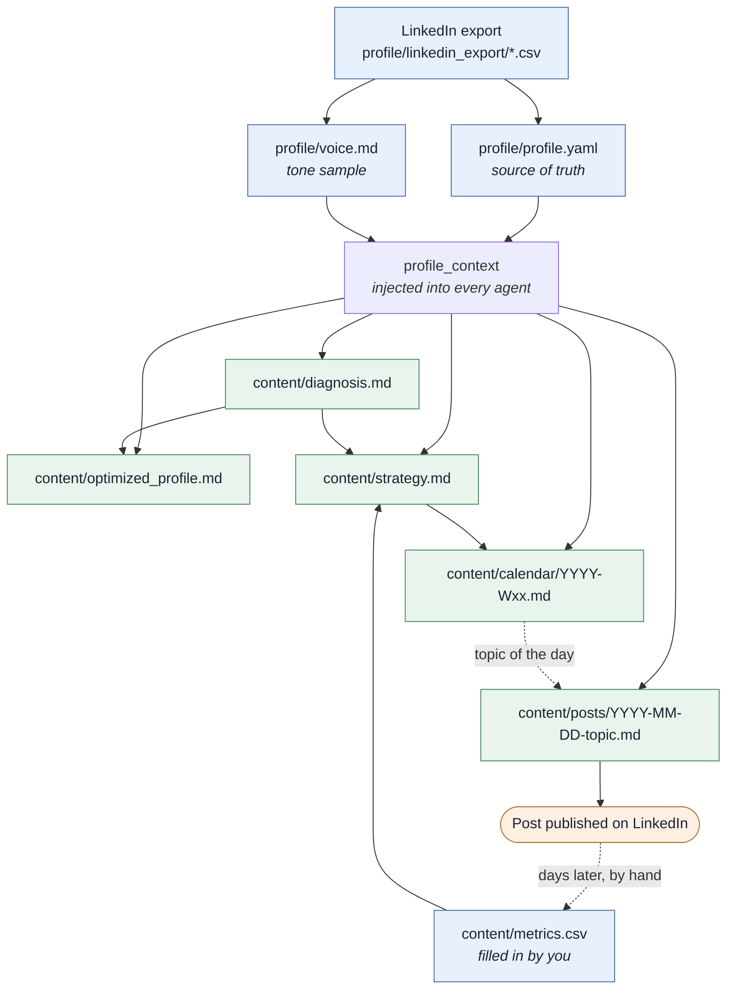
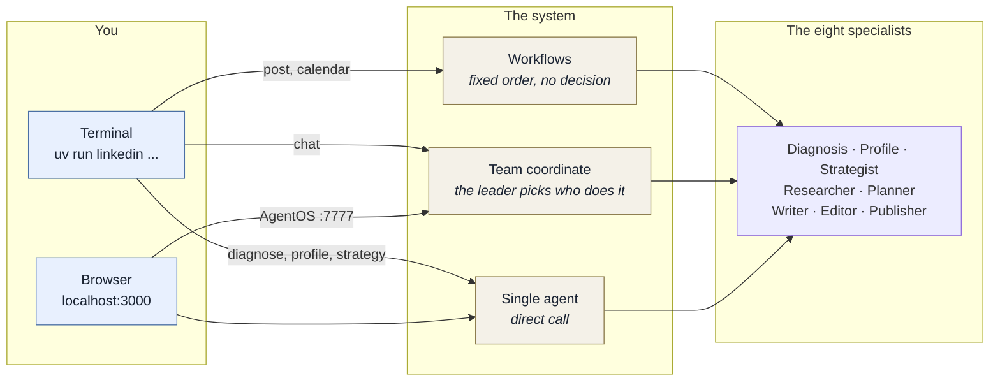
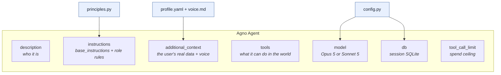
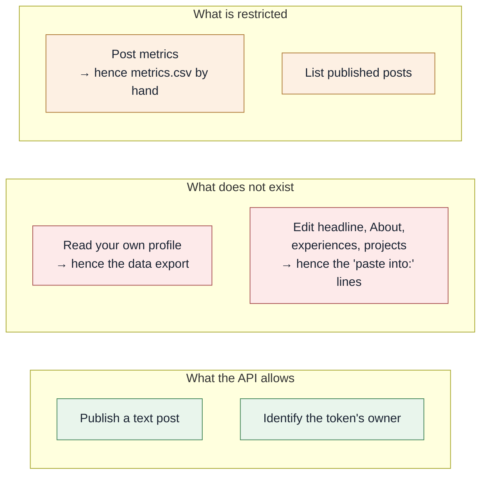

# Project mind map

This document answers one question: **what lives in here and how the pieces
connect.** For the temporal sequence, what to run first and what to run next,
see [roadmap.md](roadmap.md).

The diagrams are Mermaid. They render directly on GitHub and in VS Code's
Markdown preview.

---

## 1. The whole project



---

## 2. How the artifacts depend on each other

An arrow means **"reads"**. No agent invents context: either the fact is in the
profile, or it is in an artifact another agent already wrote.



The loop closes at `metrics.csv`. Without it the system produces forever but
never learns what worked.

---

## 3. The eight agents

They all inherit `base_instructions()` from `principles.py` and receive the
whole profile in `additional_context`. What differs between them is the role,
the tools and the model.

| Agent | Role | Tools | Model | Writes |
|---|---|---|---|---|
| **Profile Diagnosis** | Audits the profile against real job posts and scores each section 0 to 10 | `broad_search`, `save_artifact` | Opus 5 | `diagnosis.md` |
| **Profile Writer** | Headline, About, experiences, projects and skills, pt + en | `read_artifact`, `save_artifact` | Opus 5 | `optimized_profile.md` |
| **Content Strategist** | Positioning, audience, pillars, cadence, metrics, first 30 days | `read_artifact`, `save_artifact` | Opus 5 | `strategy.md` |
| **Researcher** | What happened in AI this week, with a personal angle per item | `recent_search`, `today` | Sonnet 5 | nothing, it feeds another agent |
| **Editorial Planner** | A calendar with six fields per post, including the proof asset | `today`, `read_artifact`, `list_artifacts`, `save_artifact` | Opus 5 | `calendar/YYYY-Wxx.md` |
| **Writer** | Writes the post in Portuguese and rewrites it for an international reader | `read_artifact` | Opus 5 | nothing, it hands off to the Editor |
| **Editor** | Applies the seven-criteria rubric, cuts and finalizes | `today`, `save_artifact` | Opus 5 | `posts/YYYY-MM-DD-topic.md` |
| **Publisher** | The last gate before the public. Checks the token, extracts the body, publishes | `check_linkedin_connection`, `read_artifact`, `list_artifacts`, `publish_post` | Sonnet 5 | nothing, it publishes |

**Why Sonnet in two of them:** the Researcher and the Publisher do volume and
execution work, not judgement. Opus there would be money spent for no gain.
Swappable in `.env` through `MAIN_MODEL` and `FAST_MODEL`.

---

## 4. The three ways to drive the system

The same set of agents is exposed through three different surfaces. They do not
compete; each one serves a different moment.



**When to use each:**

- **Workflow** (`post`, `calendar`): the order of the steps is already known.
  Research, write, edit, save. It spends no tokens deciding who does what, and
  the result is the same every time. This is the production path.
- **Team** (`chat`, or the web UI in Team mode): you do not know in advance who
  needs to answer. The leader reads the request, delegates and synthesizes. This
  is the conversation path.
- **Single agent** (`diagnose`, `profile`, `strategy`): one task, one
  specialist, no middleman.

The `agent_ui` only sees Agents and Teams. Workflows exist in AgentOS over HTTP
but do not show up in the chat. Run those from the CLI.

---

## 5. Anatomy of an agent

Every `build()` in `agents/` assembles the same structure. Understand one and
you understand all eight.



**The repository's golden rule:** behaviour changes in
`agents/principles.py`, not across eight files. That is where honesty,
positioning, the five pillars, the writing rules, the forbidden list and the
Editor's rubric live.

---

## 6. File map

```
profile/                         your data, out of git
  linkedin_export/               the LinkedIn .zip, unpacked
  profile.yaml                   generated and hand-reviewed · source of truth
  voice.md                       up to 25 past posts, as a tone sample

content/                         everything the system produces
  diagnosis.md                   profile audit against real job posts
  optimized_profile.md           copy ready to paste, pt and en
  strategy.md                    positioning, pillars, cadence
  calendar/YYYY-Wxx.md           editorial calendar by ISO week
  posts/YYYY-MM-DD-topic.md      post in pt and en + the Editor's evaluation
  metrics.csv                    filled in by you, by hand

src/linkedin_growth/
  config.py                      secrets, paths, models, database
  profile/
    schema.py                    the profile's Pydantic contract
    importer.py                  reads the CSVs, tolerant of variation
    context.py                   profile -> markdown for the prompt
  tools/
    artifacts.py                 read, save, list, confined to content/
    search.py                    web search via DDGS, no API key
    linkedin.py                  official API: token, URN, payload, publishing
  agents/
    principles.py                the codified strategy · start here
    <eight files>                one build() each
  team.py                        the coordinating Team
  flows.py                       the two workflows
  cli.py                         the thirteen commands
  agentos.py                     the web interface server

agent_ui/                        the Next.js interface, on :3000
tmp/linkedin_growth.db           the agents' sessions, history and memory
docs/                            this map and the roadmap
```

---

## 7. The system's boundaries

Three limits are structural. They are not missing implementation, they are what
LinkedIn allows, and they explain the shape of half the artifacts.



The system uses **only** the official API, with your consent. No scraping, no
session cookie, no driven browser, no automated connections or messages. All of
that violates the Terms of Use and gets accounts banned.

And everything is destined for **your personal profile**: the post's author is
`urn:li:person:<you>`. The Company Page exists only because LinkedIn requires
one to register any developer app.
