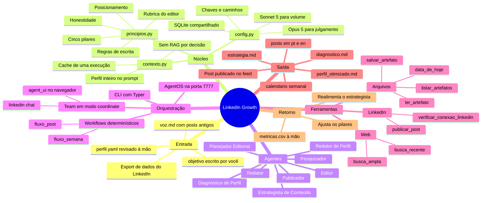
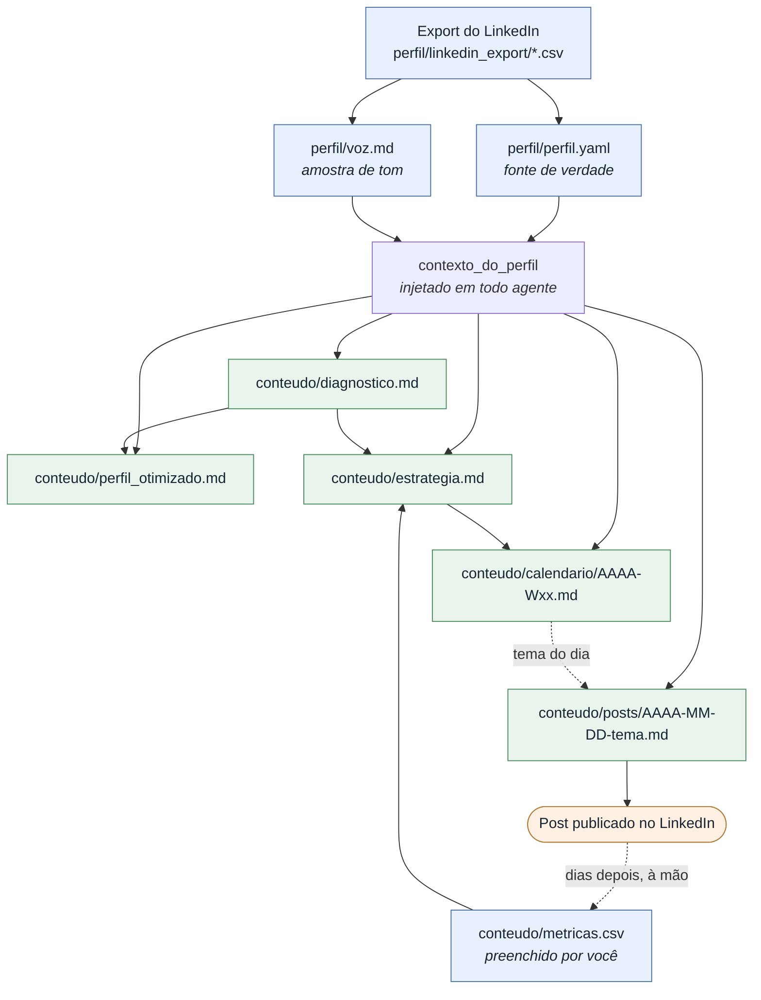
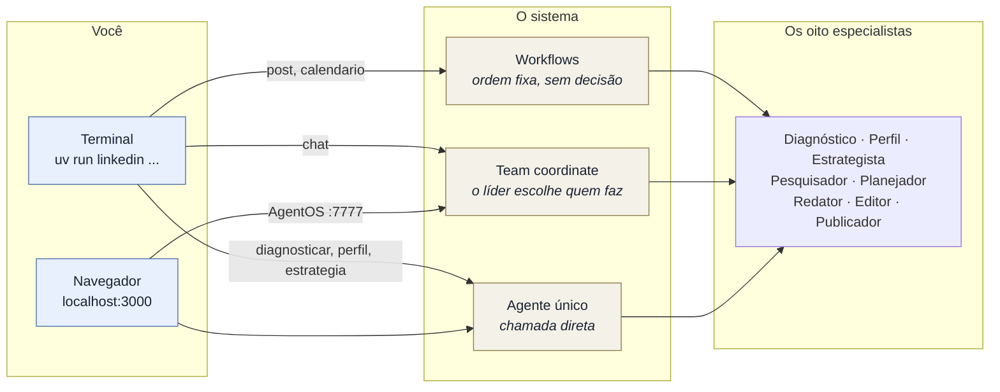
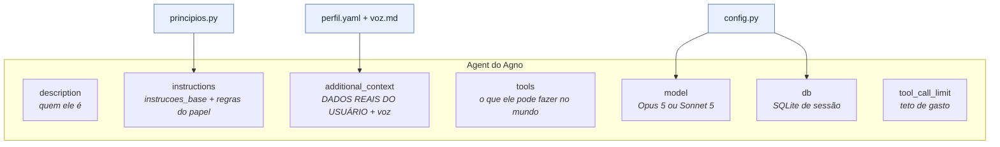
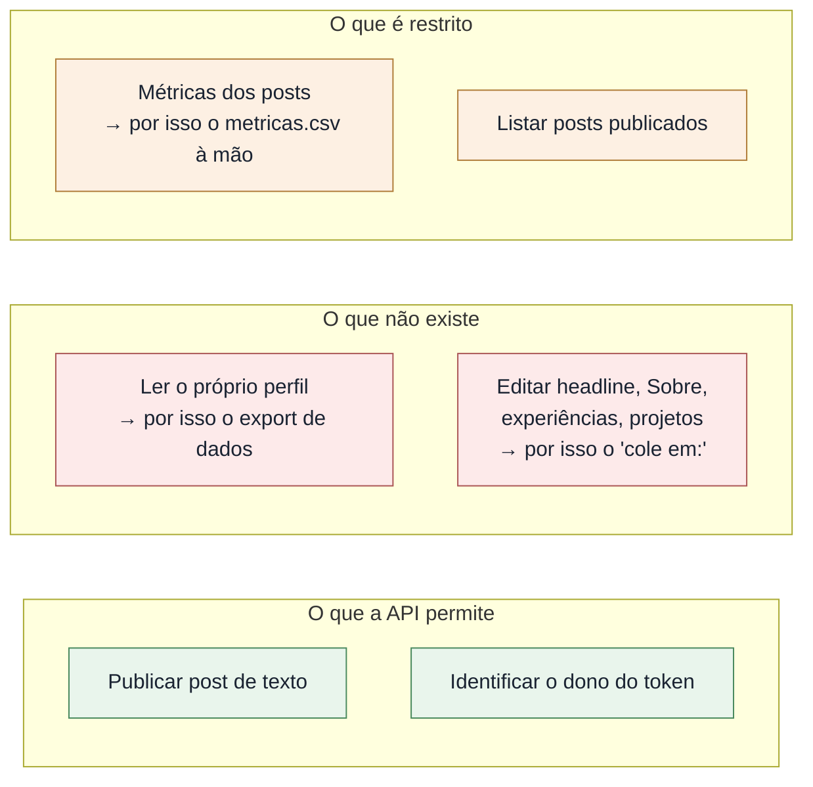

# Mapa mental do projeto

Este documento responde a uma pergunta: **o que existe aqui dentro e como as
peças se ligam.** Para a sequência temporal — o que rodar primeiro, o que rodar
depois — veja [roadmap.md](roadmap.md).

Os diagramas são Mermaid. Renderizam direto no GitHub e no preview de Markdown
do VS Code.

---

## 1. O projeto inteiro



---

## 2. Como os artefatos dependem uns dos outros

A seta significa **"lê"**. Nenhum agente inventa contexto: ou o dado está no
perfil, ou está num artefato que outro agente já gravou.



O ciclo fecha em `metricas.csv`. Sem ele o sistema produz para sempre, mas nunca
aprende o que funcionou.

---

## 3. Os oito agentes

Todos herdam `instrucoes_base()` de `principios.py` e recebem o perfil inteiro
em `additional_context`. O que muda entre eles é o papel, as ferramentas e o
modelo.

| Agente | Papel | Ferramentas | Modelo | Grava |
|---|---|---|---|---|
| **Diagnóstico de Perfil** | Audita o perfil contra vagas reais e nota cada seção de 0 a 10 | `busca_ampla`, `salvar_artefato` | Opus 5 | `diagnostico.md` |
| **Redator de Perfil** | Headline, Sobre, experiências, projetos e skills, pt + en | `ler_artefato`, `salvar_artefato` | Opus 5 | `perfil_otimizado.md` |
| **Estrategista de Conteúdo** | Posicionamento, público, pilares, cadência, métricas, 30 dias | `ler_artefato`, `salvar_artefato` | Opus 5 | `estrategia.md` |
| **Pesquisador** | O que aconteceu em IA nesta semana, com ângulo pessoal para cada item | `busca_recente`, `data_de_hoje` | Sonnet 5 | nada — alimenta outro agente |
| **Planejador Editorial** | Calendário com seis campos por post, incluindo o ativo de prova | `data_de_hoje`, `ler_artefato`, `listar_artefatos`, `salvar_artefato` | Opus 5 | `calendario/AAAA-Wxx.md` |
| **Redator** | Escreve o post em português e reescreve para o leitor internacional | `ler_artefato` | Opus 5 | nada — passa ao Editor |
| **Editor** | Aplica a rubrica de sete critérios, corta e finaliza | `data_de_hoje`, `salvar_artefato` | Opus 5 | `posts/AAAA-MM-DD-tema.md` |
| **Publicador** | Última porta antes do público. Verifica token, extrai o corpo, publica | `verificar_conexao_linkedin`, `ler_artefato`, `listar_artefatos`, `publicar_post` | Sonnet 5 | nada — publica |

**Por que Sonnet em dois deles:** Pesquisador e Publicador fazem trabalho de
volume e de execução, não de julgamento. Opus ali seria dinheiro gasto sem
ganho. Trocável em `.env` por `MODELO_PRINCIPAL` e `MODELO_RAPIDO`.

---

## 4. As três formas de acionar o sistema

O mesmo conjunto de agentes é exposto por três superfícies diferentes. Elas não
competem — cada uma serve a um momento.



**Quando usar cada uma:**

- **Workflow** (`post`, `calendario`) — a ordem dos passos já é conhecida.
  Pesquisa, escreve, edita, grava. Não gasta token decidindo quem faz o quê, e
  o resultado é o mesmo toda vez. É o caminho de produção.
- **Team** (`chat`, ou a UI web no modo Team) — você não sabe de antemão quem
  precisa responder. O líder lê o pedido, delega e sintetiza. É o caminho de
  conversa.
- **Agente único** (`diagnosticar`, `perfil`, `estrategia`) — uma tarefa, um
  especialista, sem intermediário.

A `agent_ui` só enxerga Agents e Teams. Workflows existem no AgentOS por HTTP,
mas não aparecem no chat — rode-os pela CLI.

---

## 5. Anatomia de um agente

Todo `construir()` em `agentes/` monta a mesma estrutura. Entender uma vez é
entender as oito.



**A regra de ouro do repositório:** comportamento se muda em
`agentes/principios.py`, não em oito arquivos. Lá estão a honestidade, o
posicionamento, os cinco pilares, as regras de escrita, o que é proibido, e a
rubrica do Editor.

---

## 6. Mapa dos arquivos

```
perfil/                          seus dados — fora do git
  linkedin_export/               o .zip do LinkedIn, descompactado
  perfil.yaml                    gerado e revisado à mão · fonte de verdade
  voz.md                         até 25 posts antigos, como amostra de tom

conteudo/                        tudo que o sistema produz
  diagnostico.md                 auditoria do perfil contra vagas reais
  perfil_otimizado.md            textos prontos para colar, pt e en
  estrategia.md                  posicionamento, pilares, cadência
  calendario/AAAA-Wxx.md         calendário editorial por semana ISO
  posts/AAAA-MM-DD-tema.md       post em pt e en + avaliação do Editor
  metricas.csv                   preenchido por você, à mão

src/linkedin_growth/
  config.py                      segredos, caminhos, modelos, banco
  perfil/
    esquema.py                   o contrato Pydantic do perfil
    importador.py                lê os CSVs com tolerância a variação
    contexto.py                  perfil -> markdown para o prompt
  ferramentas/
    artefatos.py                 ler, salvar, listar — confinado a conteudo/
    pesquisa.py                  busca web via DDGS, sem chave de API
    linkedin.py                  API oficial: token, URN, payload, publicação
  agentes/
    principios.py                a estratégia codificada · comece por aqui
    <oito arquivos>              um construir() cada
  times.py                       o Team coordenador
  fluxos.py                      os dois workflows
  cli.py                         os doze comandos
  agentos.py                     o servidor da interface web

agent_ui/                        a interface Next.js, em :3000
tmp/linkedin_growth.db           sessões, histórico e memória dos agentes
docs/                            este mapa e o roadmap
```

---

## 7. As fronteiras do sistema

Três limites são estruturais — não são falta de implementação, são o que o
LinkedIn permite. Eles explicam o formato de metade dos artefatos.



O sistema usa **apenas** a API oficial, com o seu consentimento. Nada de
scraping, cookie de sessão, navegador dirigido, conexão ou mensagem
automatizada — tudo isso viola os Termos de Uso e derruba conta.

E o destino de tudo é o **seu perfil pessoal**: o autor do post é
`urn:li:person:<você>`. A Company Page existe só porque o LinkedIn exige uma
para cadastrar qualquer app de desenvolvedor.
