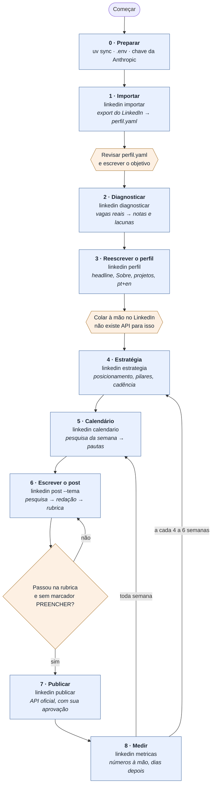
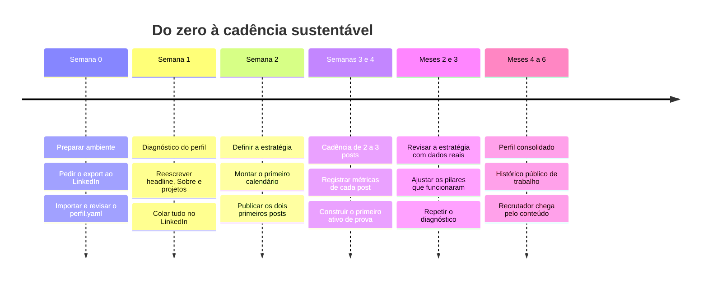
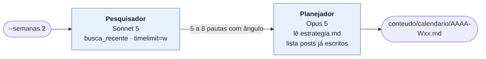
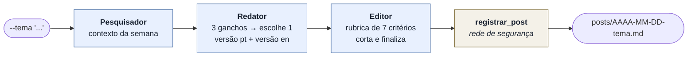

# Roadmap — do export do LinkedIn ao primeiro recrutador

Este documento descreve **o que acontece de ponta a ponta**, etapa por etapa:
o que você roda, o que o sistema faz por dentro, o que entra, o que sai, e o
que só você pode fazer.

Para a visão estrutural — quem é quem e como as peças se ligam — veja
[mindmap.md](mindmap.md).

---

## O ciclo em uma tela



Azul é o sistema trabalhando. Laranja é você — e as três caixas laranjas são
obrigatórias: **nenhuma delas pode ser automatizada**, por decisão de projeto
ou por limite do LinkedIn.

---

## Linha do tempo sugerida



O gargalo real não é o sistema — é o **ativo de prova**. O Planejador marca
`PRECISA CONSTRUIR` quando um post não tem código, medição ou print para
mostrar. Esses são os itens que levam semanas, não minutos.

---

## As nove etapas, em detalhe

### Etapa 0 · Preparar o ambiente

| | |
|---|---|
| **Comando** | `uv sync` · `cp .env.example .env` |
| **Entra** | Python 3.13+, uv, uma chave da Anthropic |
| **Sai** | Ambiente instalado e `.env` preenchido |
| **Tempo típico** | 15 minutos |

**O que acontece por dentro**

1. `uv sync` instala as dependências travadas em `uv.lock`.
2. `config.py` carrega o `.env` com `load_dotenv()` no import.
3. `garantir_diretorios()` cria, de forma idempotente, `perfil/`,
   `perfil/linkedin_export/`, `conteudo/`, `conteudo/calendario/`,
   `conteudo/posts/` e `tmp/`.
4. O banco SQLite em `tmp/linkedin_growth.db` é criado sob demanda, na primeira
   execução que precisar dele — não no import.

**O que exige você:** preencher `ANTHROPIC_API_KEY`. É a única chave
obrigatória. Sem ela, todo comando de agente para com uma mensagem que explica
como resolver, em vez de estourar um traceback.

**Opcional aqui:** `MODELO_PRINCIPAL` e `MODELO_RAPIDO` no `.env` se você quiser
trocar Opus por Sonnet e gastar menos.

**Pronto quando:** `uv run linkedin status` roda sem erro.

---

### Etapa 1 · Importar o seu perfil real

| | |
|---|---|
| **Comando** | `uv run linkedin importar` |
| **Entra** | `perfil/linkedin_export/*.csv` |
| **Sai** | `perfil/perfil.yaml` e `perfil/voz.md` |
| **Tempo típico** | export leva de minutos a 24h · revisão, 30 a 45 minutos |

**Por que este passo existe:** o LinkedIn **não tem API para ler o seu próprio
perfil**. O caminho oficial é o export de dados: *Configurações e privacidade →
Privacidade de dados → Obter uma cópia dos seus dados*. Peça o arquivo completo
e descompacte o `.zip` dentro de `perfil/linkedin_export/`.

**O que acontece por dentro**

1. O importador varre **todo** `.csv` da pasta e casa cada arquivo por nome
   normalizado — `Positions.csv`, `Education.csv`, `Skills.csv` e companhia.
2. Cada coluna é casada por **lista de sinônimos**, ignorando caixa e
   pontuação. Isso é deliberado: o LinkedIn não documenta os nomes das colunas,
   e eles mudam com o tempo e com o idioma da conta. Um parser rígido quebraria
   em silêncio.
3. As linhas de aviso que o LinkedIn coloca antes do cabeçalho real são
   puladas.
4. Os dados viram um `Perfil` Pydantic: identidade, experiências, formações,
   certificações, projetos, idiomas, skills e posts antigos.
5. `salvar()` grava o `perfil.yaml` — **preservando** `objetivo` e
   `temas_de_interesse` se você já os tiver editado. Reimportar não apaga o que
   é seu.
6. `salvar_voz()` grava até 25 posts antigos em `perfil/voz.md`. É a amostra de
   tom que faz os agentes escreverem como você, e não como um gerador genérico.
7. O terminal mostra uma tabela do que foi reconhecido, a lista do que foi
   ignorado, e avisos explícitos quando o nome ou as experiências não vieram.

**O que exige você:** abrir o `perfil.yaml`, corrigir o que o importador não
pegou e **escrever o campo `objetivo` com as suas palavras**. Esse arquivo é a
fonte de verdade de todos os agentes — o que estiver errado ali sai errado em
tudo.

**Pronto quando:** o `perfil.yaml` descreve você corretamente e o `objetivo`
não é mais o texto padrão.

---

### Etapa 2 · Diagnosticar o perfil

| | |
|---|---|
| **Comando** | `uv run linkedin diagnosticar` |
| **Quem executa** | Agente **Diagnóstico de Perfil** · Opus 5 |
| **Entra** | perfil.yaml + vagas reais buscadas na web |
| **Sai** | `conteudo/diagnostico.md` |
| **Tempo típico** | 2 a 5 minutos |

**O que acontece por dentro**

1. O agente é instruído a se comportar como um recrutador técnico sênior que
   aceitou revisar o perfil — direto, específico, disposto a dizer o que está
   ruim.
2. Ele **começa pela web**: busca de 5 a 8 vagas reais de engenharia de IA,
   júnior e pleno, Brasil e remoto, usando `busca_ampla` — sem recorte de
   tempo, porque descrição de vaga não envelhece em uma semana. A ordem
   importa: primeiro o mercado de hoje, não o que o modelo lembra do
   treinamento.
3. Extrai das vagas as skills mais repetidas, as ferramentas nomeadas e o que
   aparece como diferencial.
4. Compara o seu perfil real com esse retrato e dá **nota de 0 a 10 por seção**
   — Headline, Sobre, Experiência, Projetos, Skills, Formação — justificando
   cada nota em uma frase e citando o que está escrito lá.
5. Lista as lacunas **em ordem de impacto**, separando o que é "reescrever
   texto", que leva minutos, do que é "precisa construir algo", que leva
   semanas.
6. Chama `salvar_artefato` e grava `diagnostico.md`.

**Regra que ele não pode quebrar:** se faltam meses de projeto até uma vaga, o
relatório diz que faltam meses. O agente é instruído a não consolar.

**Pronto quando:** `conteudo/diagnostico.md` existe e você concorda com o
diagnóstico — ou corrigiu o `perfil.yaml` e rodou de novo.

---

### Etapa 3 · Reescrever os textos do perfil

| | |
|---|---|
| **Comando** | `uv run linkedin perfil` |
| **Quem executa** | Agente **Redator de Perfil** · Opus 5 |
| **Entra** | perfil.yaml + `diagnostico.md` |
| **Sai** | `conteudo/perfil_otimizado.md` |
| **Tempo típico** | 3 minutos de execução · 30 minutos colando |

**O que acontece por dentro**

1. Lê `diagnostico.md` com `ler_artefato` — ele já diz onde estão as lacunas.
2. Produz, nesta ordem:
   - **Headline** — três opções de até 220 caracteres, cada uma com uma linha
     explicando o que prioriza, e uma recomendação.
   - **Sobre** — de 900 a 1500 caracteres, abrindo com a frase mais forte,
     porque o LinkedIn corta em ~270.
   - **Experiência** — cada cargo **real** reescrito em duas a quatro linhas,
     focando no que é transferível para IA: dados, automação, lógica, produto,
     comunicação.
   - **Projetos** — descrição de cada projeto real. Se você tem poucos, ele diz
     isso e sugere dois ou três projetos concretos com escopo de uma a duas
     semanas.
   - **Skills** — a lista exata a marcar, separando "já tenho" de "terei quando
     terminar X".
3. Cada bloco começa com uma instrução de destino: `>> Cole em: Perfil > Sobre
   > Editar`.
4. Tudo sai em português e depois em inglês — recrutador internacional lê o
   perfil em inglês.

**Por que a saída é "pronto para colar":** **não existe API para editar o perfil
do LinkedIn.** Em nenhum nível, para nenhum app. Headline, Sobre, experiências,
projetos e skills só mudam com você digitando. O produto deste agente é um
documento de copiar e colar, e isso é uma consequência da plataforma, não uma
escolha de preguiça.

**O que exige você:** colar. Reserve meia hora.

**Pronto quando:** o seu perfil no LinkedIn está com os textos novos.

---

### Etapa 4 · Definir a estratégia

| | |
|---|---|
| **Comando** | `uv run linkedin estrategia` |
| **Quem executa** | Agente **Estrategista de Conteúdo** · Opus 5 |
| **Entra** | perfil.yaml + `diagnostico.md` + `metricas.csv` se existir |
| **Sai** | `conteudo/estrategia.md` |
| **Tempo típico** | 3 minutos de execução · 15 minutos lendo |

**O que acontece por dentro**

1. Lê `diagnostico.md` e `metricas.csv`. **Se houver métricas, elas mandam:** os
   pilares que geraram comentário de gente da área ganham mais espaço na semana.
   É aqui que o ciclo se fecha.
2. Produz oito seções:

   | # | Seção | O que responde |
   |---|---|---|
   | 1 | Posicionamento | A frase única — uma frase, não um parágrafo |
   | 2 | Público | Quem atrair, com nome de cargo e o que essa pessoa procura |
   | 3 | Pilares | Os cinco pilares adaptados ao seu caso, com proporção semanal |
   | 4 | Cadência | Quantos posts e em que dias, considerando emprego e estudo |
   | 5 | Tom | Uma frase que soa como você e uma que **não** soa |
   | 6 | O que não postar | Lista explícita, para o seu caso |
   | 7 | Métricas | O que olhar por mês e qual número indica que funcionou |
   | 8 | Primeiros 30 dias | O que fazer nas quatro primeiras semanas |

3. Grava `estrategia.md`.

**O viés embutido:** o agente prefere um plano pequeno que você mantém a um
plano ambicioso que você abandona em três semanas. Dois posts que saem valem
mais que cinco planejados.

**Os cinco pilares padrão**, definidos em `principios.py`:

- **Construí** — o que montei nesta semana, com o link do código
- **Quebrou** — o erro que levei horas para entender e como resolvi
- **Entendi** — um conceito explicado do meu jeito, sem copiar a documentação
- **Li** — um paper ou release comentado, com opinião, não resumo
- **Comparei** — duas ferramentas ou abordagens, com critério explícito

**Pronto quando:** você consegue dizer em uma frase como quer ser percebido em
seis meses.

---

### Etapa 5 · Montar o calendário editorial

| | |
|---|---|
| **Comando** | `uv run linkedin calendario --semanas 2` |
| **Quem executa** | Workflow `fluxo_semana` · Pesquisador → Planejador |
| **Entra** | `estrategia.md` + a web da última semana + posts já escritos |
| **Sai** | `conteudo/calendario/AAAA-Wxx.md` |
| **Tempo típico** | 4 minutos |

**Por que é um Workflow e não um Team:** a ordem já é conhecida. Um workflow não
gasta token decidindo quem faz o quê, e o resultado é o mesmo toda vez.



**Passo 1 — Pesquisador.** Chama `data_de_hoje` antes de qualquer coisa, porque
precisa saber a data real antes de falar em "esta semana". Faz de três a cinco
buscas com ângulos diferentes: lançamentos, discussões técnicas, práticas de
engenharia de LLM e o recorte brasileiro. A busca é limitada à última semana —
sem esse recorte, o resultado volta com artigo de 2023. Descarta anúncio de
rodada, hype sem conteúdo técnico e qualquer coisa que você não tenha como
testar. Para cada item devolve título, link, uma frase do que é, e — o campo que
importa — o **ângulo que você especificamente** poderia usar.

**Passo 2 — Planejador.** Lê `estrategia.md`. Usa `listar_artefatos` em `posts`
para não repetir tema já escrito. Define **seis campos por post**: data, pilar,
tema, formato, **ativo de prova** e gancho provisório.

**A regra que salva o calendário:** tema vago é o que mata calendário editorial.
*"Falar sobre RAG"* é vago. *"Por que meu RAG piorou quando aumentei o chunk
size de 500 para 2000"* é um tema. Se não há ativo de prova para um post, o
campo vem marcado como `PRECISA CONSTRUIR`, com o que você precisa fazer antes.

**Pronto quando:** todo post da semana tem tema específico e ativo de prova — ou
um `PRECISA CONSTRUIR` que você aceitou.

---

### Etapa 6 · Escrever um post

| | |
|---|---|
| **Comando** | `uv run linkedin post --tema "o erro de encoding que me custou 3 horas"` |
| **Quem executa** | Workflow `fluxo_post` · Pesquisador → Redator → Editor → registro |
| **Entra** | o tema + perfil.yaml + voz.md |
| **Sai** | `conteudo/posts/AAAA-MM-DD-tema.md` |
| **Tempo típico** | 5 minutos |



**Passo 1 — Pesquisador.** Mesmo agente da etapa 5, aqui trazendo contexto para
o tema.

**Passo 2 — Redator.** Antes de escrever, decide e declara três coisas: o
pilar, a única ideia que o post defende, e a prova que ele mostra. Escreve
**três ganchos diferentes** para a primeira linha e descarta o primeiro que veio
à cabeça — é sempre o mais genérico. A versão em inglês não é tradução literal:
é o mesmo post reescrito para o leitor internacional, com outras referências,
outro ritmo e hashtags do ecossistema em inglês.

Se faltar informação real para sustentar o post, ele **não inventa**: deixa um
marcador `[PREENCHER: ...]` e lista no final o que você precisa completar.

**Passo 3 — Editor.** Aplica a rubrica de sete critérios, 0 a 10 cada:

| Critério | O que pergunta |
|---|---|
| **Gancho** | A primeira linha para o scroll sozinha? Nota 0 se for pergunta retórica genérica |
| **Verdade** | Tudo está sustentado pelos dados reais? **Nota 0 reprova o post inteiro** |
| **Prova** | Aponta para algo verificável — código, número, print, link? |
| **Especificidade** | Tem detalhe que só quem fez saberia, ou daria para escrever pela documentação? |
| **Legibilidade** | Parágrafos curtos, respiro visual, funciona no celular? |
| **Voz** | Soa como você, ou soa como LLM? |
| **Fechamento** | A pergunta final é concreta e dá vontade de responder? |

Detectar voz de LLM é parte explícita do trabalho dele: frases em espelho
*"não é só X, é Y"*, adjetivos aos pares, transições arrumadinhas demais,
parágrafo final que recapitula o post. Tudo isso é cortado.

Ele entrega a nota total, os três cortes de maior impacto com o texto exato a
mudar, e a versão final revisada. Se **Verdade** for 0, ele salva mesmo assim
com `status: reprovado` e explica o que precisa sair — um post que mente sobre
experiência é o único erro irreversível deste sistema.

**Passo 4 — `registrar_post`.** Código, não agente. O Editor normalmente salva
sozinho; este passo confere. Se nenhum arquivo foi gravado nos últimos cinco
minutos, ele mesmo grava. Um fluxo que roda até o fim e não deixa arquivo é pior
que um que falha.

**O arquivo final** tem front-matter (`data`, `pilar`, `tema`, `status`,
`nota`), a versão `## Post (pt-BR)`, a versão `## Post (en)` e a avaliação do
Editor.

**O que exige você:** completar os `[PREENCHER]`, se houver. E ler o post — ele
vai sair com o seu nome.

**Pronto quando:** o arquivo não tem `[PREENCHER]` e a nota de Verdade não é 0.

---

### Etapa 7 · Publicar

| | |
|---|---|
| **Comando** | `uv run linkedin publicar conteudo/posts/AAAA-MM-DD-tema.md` |
| **Entra** | o arquivo do post + `LINKEDIN_ACCESS_TOKEN` |
| **Sai** | um post público no **seu perfil pessoal** |
| **Tempo típico** | menos de um minuto |

**Pré-requisito, feito uma vez.** Publicar é o único comando que precisa de
token. O passo a passo está no README, seção *Conectar o LinkedIn*, e resumido:
criar uma Company Page (o LinkedIn exige uma para cadastrar qualquer app — pode
ser vazia), criar o app, adicionar os produtos *Share on LinkedIn* e *Sign In
with LinkedIn using OpenID Connect*, gerar o token com `openid`, `profile` e
`w_member_social`. Confira com `uv run linkedin conexao`. **O token dura 60
dias** e você gera outro no mesmo lugar quando expirar.

**O que acontece por dentro**

1. A CLI lê o arquivo e extrai **só a seção do idioma pedido** — `## Post
   (pt-BR)` ou `## Post (en)` — por regex, parando no próximo `##`. Front-matter,
   metadados e avaliação do Editor nunca vão para o feed.
2. Se sobrou algum `[PREENCHER]`, o comando **recusa** publicar e diz o que
   falta.
3. Mostra o texto exato e a contagem de caracteres.
4. Com `--dry-run`, imprime o JSON que seria enviado — os dois payloads, o
   versionado e o legado — e para por aí.
5. Sem `--dry-run`, pede confirmação explícita. Um post publicado é público e
   imediato.
6. Busca o seu URN em `/v2/userinfo` e monta o autor como
   `urn:li:person:<seu id>`.
7. Converte o texto para o *little text format*: quinze caracteres são
   reservados pela API e precisam de contrabarra — inclusive parênteses, que
   aparecem o tempo todo. As hashtags viram o template que o LinkedIn
   transforma em link clicável. Sem isso, o post falha ou sai deformado.
8. Envia para `POST /rest/posts`. Se o LinkedIn responder **403** — o que
   acontece quando o app só tem *Share on LinkedIn* — cai automaticamente para
   o endpoint legado `POST /v2/ugcPosts`, que a página self-serve documenta e
   que aceita texto puro, sem escape.
9. Devolve a URL do post, montada a partir do header `x-restli-id`.

**Onde o post sai:** no **seu feed pessoal**. O autor é `urn:li:person`. A
Company Page do passo de cadastro não recebe nada — publicar como página seria
`urn:li:organization` e exigiria a *Community Management API*, que só sai com
aprovação de parceiro.

**Pronto quando:** o terminal devolveu a URL do post.

---

### Etapa 8 · Medir e realimentar

| | |
|---|---|
| **Comando** | `uv run linkedin metricas` |
| **Entra** | os números que você lê no LinkedIn, à mão |
| **Sai** | uma linha em `conteudo/metricas.csv` |
| **Tempo típico** | 3 minutos por post, alguns dias depois |

**Por que é manual:** o LinkedIn **bloqueia** o acesso self-serve às métricas
dos próprios posts. Não é falta de implementação — é acesso restrito. Ou os
números entram à mão, ou o sistema nunca aprende.

**O que acontece por dentro.** O comando pergunta e grava nove colunas:

`data` · `arquivo` · `pilar` · `impressoes` · `reacoes` · `comentarios` ·
`visualizacoes_perfil` · `contatos_recrutador` · `observacao`

**O que realmente importa nessas colunas.** Curtida não é métrica. O que conta,
segundo `principios.py`: comentário de alguém relevante da área, visualização de
perfil, pedido de conexão de recrutador e mensagem direta. As colunas
`visualizacoes_perfil` e `contatos_recrutador` são as que decidem se o sistema
está funcionando.

**Como o ciclo fecha:** o Estrategista lê este CSV na próxima vez que você rodar
`linkedin estrategia`. Os pilares que geraram conversa com gente da área ganham
mais espaço; os que só geraram curtida perdem. Sem esse arquivo, o sistema
produz para sempre no escuro.

**Pronto quando:** cada post publicado tem uma linha no CSV.

---

## As superfícies transversais

Estes comandos não são etapas — funcionam a qualquer momento do ciclo.

| Comando | Para quê |
|---|---|
| `uv run linkedin status` | O que já existe e qual é o próximo passo. Rode quando estiver perdido |
| `uv run linkedin chat` | Conversa com o time no terminal. O líder escolhe o especialista |
| `uv run linkedin conexao` | Confere se o token do LinkedIn está válido |
| `uv run linkedin serve` | Sobe o AgentOS em `:7777` para a interface web |

**A interface web**, em dois terminais:

```bash
uv run linkedin serve          # backend em :7777
cd agent_ui && pnpm dev        # interface em :3000
```

Abra `localhost:3000` e escolha o modo **Team**. A UI só conhece Agents e Teams
— os workflows (`post`, `calendario`) rodam pela CLI.

---

## Estado do produto

O que está construído, o que não existe, e o que está fora do nosso alcance.

| Capacidade | Estado | Nota |
|---|---|---|
| Importar o perfil do export | ✅ Pronto | Tolerante a variação de coluna e idioma |
| Diagnóstico contra vagas reais | ✅ Pronto | Busca web sem chave de API |
| Textos de perfil pt + en | ✅ Pronto | Saída "pronto para colar" |
| Estratégia e pilares | ✅ Pronto | Realimentada por `metricas.csv` |
| Calendário editorial | ✅ Pronto | Com ativo de prova obrigatório |
| Post pt + en com rubrica | ✅ Pronto | Rubrica de 7 critérios, Verdade reprova |
| Publicar post de texto | ✅ Pronto | API oficial, com aprovação, fallback para o endpoint legado |
| Interface web de chat | ✅ Pronto | Agno Agent UI, modo Team |
| Publicar imagem, carrossel PDF | ⚙️ Não implementado | A API permite; o código hoje só envia texto |
| Editar o perfil automaticamente | ❌ Não existe API | Em nenhum nível, para nenhum app |
| Ler o próprio perfil por API | ❌ Não existe API | Por isso o export de dados |
| Ler métricas dos posts | 🔒 Bloqueado pelo LinkedIn | Acesso restrito. Entra à mão |
| Listar posts já publicados | 🔒 Bloqueado pelo LinkedIn | `r_member_social` está fechado |
| Refresh automático de token | 🔒 Só para parceiros | Gere outro a cada 60 dias |
| Publicar como Company Page | 🔒 Exige aprovação | Precisaria da Community Management API |

O sistema usa **apenas** a API oficial com o seu consentimento. Não faz
scraping, não usa cookie de sessão, não dirige navegador, não automatiza conexão
nem mensagem — tudo isso é proibido pelos Termos de Uso do LinkedIn e derruba
conta.

---

## Evoluções possíveis

Ideias, não compromissos. Nenhuma está agendada.

**Curto prazo — melhoram o que já existe**

- Publicar com imagem e carrossel em PDF. A API permite; falta o upload de
  mídia em `ferramentas/linkedin.py`. É o item de maior ganho por esforço,
  porque carrossel tem alcance melhor que texto puro.
- Um comando `revisar` que passa um post já escrito pelo Editor de novo, sem
  refazer a pesquisa.
- Agendamento: gerar a semana inteira de posts de uma vez, a partir do
  calendário, em vez de um `--tema` por vez.

**Médio prazo — fecham o ciclo com mais força**

- Um agente que lê o `metricas.csv` e escreve um relatório mensal do que
  funcionou, em vez de deixar essa leitura embutida no Estrategista.
- Rastrear o ativo de prova: cruzar os `PRECISA CONSTRUIR` do calendário com o
  que de fato foi construído, para o gargalo real ficar visível.
- Repetir o diagnóstico periodicamente e comparar as notas ao longo do tempo —
  a curva das seções do perfil é o indicador mais honesto de progresso.

**O que não vale a pena tentar**

- Automatizar a edição do perfil por navegador. Viola os Termos de Uso e o risco
  é a conta.
- Raspar métricas da interface web. Mesmo motivo.
- Automatizar conexões e mensagens. Mesmo motivo, com o agravante de queimar
  reputação com o público que você quer atrair.

---

## Onde mexer quando quiser mudar o comportamento

`src/linkedin_growth/agentes/principios.py`. Ali estão as regras de honestidade,
o posicionamento, os cinco pilares, as regras de escrita, a lista do que é
proibido e a rubrica do Editor. Mudar o sistema é mudar esse arquivo — não os
oito arquivos de agente.
