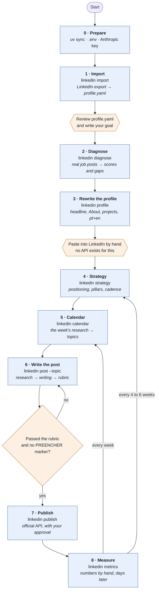
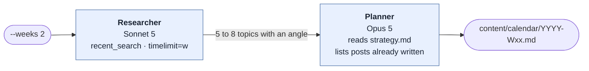
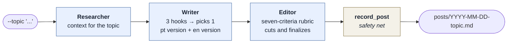

# Roadmap: from the LinkedIn export to the first recruiter

This document describes **what happens end to end**, stage by stage: what you
run, what the system does internally, what goes in, what comes out, and what
only you can do.

For the structural view, who is who and how the pieces connect, see
[mindmap.md](mindmap.md).

---

## The cycle on one screen



Blue is the system working. Orange is you, and the three orange boxes are
mandatory: **none of them can be automated**, either by design or by LinkedIn's
limits.

---

## A suggested timeline


The real bottleneck is not the system, it is the **proof asset**. The Planner
marks `NEEDS BUILDING` when a post has no code, measurement or screenshot to
show. Those are the items that take weeks, not minutes.

---

## The nine stages, in detail

### Stage 0 · Prepare the environment

| | |
|---|---|
| **Command** | `uv sync` · `cp .env.example .env` |
| **In** | Python 3.13+, uv, an Anthropic key |
| **Out** | An installed environment and a filled-in `.env` |
| **Typical time** | 15 minutes |

**What happens internally**

1. `uv sync` installs the dependencies pinned in `uv.lock`.
2. `config.py` loads `.env` with `load_dotenv()` at import time.
3. `ensure_directories()` idempotently creates `profile/`,
   `profile/linkedin_export/`, `content/`, `content/calendar/`,
   `content/posts/` and `tmp/`.
4. The SQLite database in `tmp/linkedin_growth.db` is created on demand, on the
   first run that needs it, not at import.

**What needs you:** filling in `ANTHROPIC_API_KEY`. It is the only required key.
Without it, every agent command stops with a message explaining how to fix it
rather than blowing up with a traceback.

**Optional here:** `MAIN_MODEL` and `FAST_MODEL` in `.env` if you want to swap
Opus for Sonnet and spend less.

**Done when:** `uv run linkedin status` runs without error.

---

### Stage 1 · Import your real profile

| | |
|---|---|
| **Command** | `uv run linkedin import` |
| **In** | `profile/linkedin_export/*.csv` |
| **Out** | `profile/profile.yaml` and `profile/voice.md` |
| **Typical time** | the export takes minutes to 24h · the review, 30 to 45 minutes |

**Why this step exists:** LinkedIn **has no API for reading your own profile**.
The official route is the data export: *Settings & Privacy → Data privacy → Get
a copy of your data*. Request the complete archive and unzip it into
`profile/linkedin_export/`.

**What happens internally**

1. The importer sweeps **every** `.csv` in the folder and matches each file by
   normalized name: `Positions.csv`, `Education.csv`, `Skills.csv` and company.
2. Each column is matched against a **list of synonyms**, ignoring case and
   punctuation. That is deliberate: LinkedIn does not document the column names,
   and they change over time and with the account's language. A rigid parser
   would break silently.
3. The warning lines LinkedIn puts before the real header are skipped.
4. The data becomes a Pydantic `Profile`: identity, experiences, education,
   certifications, projects, languages, skills and past posts.
5. `save()` writes `profile.yaml`, **preserving** `goal` and
   `topics_of_interest` if you have already edited them. Re-importing does not
   erase what is yours.
6. `save_voice()` writes up to 25 past posts into `profile/voice.md`. That is
   the tone sample that makes the agents write like you rather than like a
   generic generator.
7. The terminal shows a table of what was recognized, the list of what was
   ignored, and explicit warnings when the name or the experiences did not come
   through.

**What needs you:** opening `profile.yaml`, fixing what the importer missed and
**writing the `goal` field in your own words**. That file is every agent's
source of truth: whatever is wrong there comes out wrong everywhere.

**Done when:** `profile.yaml` describes you correctly and `goal` is no longer
the default text.

---

### Stage 2 · Diagnose the profile

| | |
|---|---|
| **Command** | `uv run linkedin diagnose` |
| **Who runs it** | The **Profile Diagnosis** agent · Opus 5 |
| **In** | profile.yaml + real job posts searched on the web |
| **Out** | `content/diagnosis.md` |
| **Typical time** | 2 to 5 minutes |

**What happens internally**

1. The agent is instructed to behave like a senior technical recruiter who
   agreed to review the profile: direct, specific, willing to say what is bad.
2. It **starts with the web**: it searches 5 to 8 real AI engineering job posts,
   junior and mid level, Brazil and remote, using `broad_search`, with no time
   window, because a job description does not age in a week. The order matters:
   today's market first, not what the model remembers from training.
3. It pulls out of those posts the most repeated skills, the tools named by
   name, and what appears as a differentiator.
4. It compares your real profile against that picture and gives **a score from 0
   to 10 per section**: Headline, About, Experience, Projects, Skills,
   Education, justifying each score in one sentence and quoting what is actually
   written there.
5. It lists the gaps **in order of impact**, separating "rewrite some text",
   which takes minutes, from "needs something built", which takes weeks.
6. It calls `save_artifact` and writes `diagnosis.md`.

**The rule it may not break:** if a job is months of project work away, the
report says months. The agent is instructed not to console.

**Done when:** `content/diagnosis.md` exists and you agree with the diagnosis,
or you fixed `profile.yaml` and ran it again.

---

### Stage 3 · Rewrite the profile copy

| | |
|---|---|
| **Command** | `uv run linkedin profile` |
| **Who runs it** | The **Profile Writer** agent · Opus 5 |
| **In** | profile.yaml + `diagnosis.md` |
| **Out** | `content/optimized_profile.md` |
| **Typical time** | 3 minutes to run · 30 minutes pasting |

**What happens internally**

1. It reads `diagnosis.md` with `read_artifact`: that already says where the
   gaps are.
2. It produces, in this order:
   - **Headline**: three options of up to 220 characters, each with one line
     explaining what it prioritizes, plus a recommendation.
   - **About**: 900 to 1500 characters, opening with the strongest sentence,
     because LinkedIn truncates at about 270.
   - **Experience**: each **real** job rewritten in two to four lines, focused
     on what transfers to AI: data, automation, logic, product, communication.
   - **Projects**: a description for each real project. If you have few, it says
     so and suggests two or three concrete projects scoped to one or two weeks.
   - **Skills**: the exact list to tick, separating "already have" from "will
     have once X is done".
3. Every block starts with a destination instruction:
   `>> Cole em: Perfil > Sobre > Editar`.
4. Everything comes out in Portuguese and then in English: an international
   recruiter reads the profile in English.

**Why the output is "ready to paste":** **there is no API for editing a LinkedIn
profile.** At any tier, for any app. Headline, About, experiences, projects and
skills only change when you type. This agent's product is a copy-and-paste
document, and that is a consequence of the platform, not laziness.

**What needs you:** pasting. Set aside half an hour.

**Done when:** your LinkedIn profile carries the new copy.

---

### Stage 4 · Define the strategy

| | |
|---|---|
| **Command** | `uv run linkedin strategy` |
| **Who runs it** | The **Content Strategist** agent · Opus 5 |
| **In** | profile.yaml + `diagnosis.md` + `metrics.csv` if it exists |
| **Out** | `content/strategy.md` |
| **Typical time** | 3 minutes to run · 15 minutes reading |

**What happens internally**

1. It reads `diagnosis.md` and `metrics.csv`. **If there are metrics, they
   rule:** the pillars that earned comments from people in the field get more
   room in the week. This is where the loop closes.
2. It produces eight sections:

   | # | Section | What it answers |
   |---|---|---|
   | 1 | Positioning | The single sentence. One sentence, not a paragraph |
   | 2 | Audience | Who to attract, with job titles and what that person is looking for |
   | 3 | Pillars | The five pillars adapted to your case, with a weekly share |
   | 4 | Cadence | How many posts and on which days, given a job and studying |
   | 5 | Tone | One sentence that sounds like you and one that does **not** |
   | 6 | What not to post | An explicit list, for your case |
   | 7 | Metrics | What to look at monthly and which number says it worked |
   | 8 | First 30 days | What to do in the first four weeks |

3. It writes `strategy.md`.

**The built-in bias:** the agent prefers a small plan you keep to an ambitious
one you abandon in three weeks. Two posts that ship beat five that are planned.

**The five default pillars**, defined in `principles.py`:

- **Built**: what I put together this week, with a link to the code
- **Broke**: the error that took me hours to understand, and how I solved it
- **Understood**: a concept explained in my own words, not copied from the docs
- **Read**: a paper or release with my opinion on it, not a summary
- **Compared**: two tools or approaches, with the criteria stated

**Done when:** you can say in one sentence how you want to be perceived in six
months.

---

### Stage 5 · Build the editorial calendar

| | |
|---|---|
| **Command** | `uv run linkedin calendar --weeks 2` |
| **Who runs it** | The `week_flow` workflow · Researcher → Planner |
| **In** | `strategy.md` + last week's web + posts already written |
| **Out** | `content/calendar/YYYY-Wxx.md` |
| **Typical time** | 4 minutes |

**Why it is a Workflow and not a Team:** the order is already known. A workflow
spends no tokens deciding who does what, and the result is the same every time.



**Step 1, the Researcher.** It calls `today` before anything else, because it
needs the real date before talking about "this week". It runs three to five
searches from different angles: releases, technical discussions, LLM engineering
practices and the Brazilian angle. The search is limited to the last week;
without that window the results come back with articles from 2023. It discards
funding announcements, hype with no technical content and anything you have no
way to test. For each item it returns a title, a link, one sentence on what it
is, and, the field that matters, the **angle you specifically** could take.

**Step 2, the Planner.** It reads `strategy.md`. It uses `list_artifacts` on
`posts` so it does not repeat a topic already written. It defines **six fields
per post**: date, pillar, topic, format, **proof asset** and a provisional hook.

**The rule that saves the calendar:** a vague topic is what kills an editorial
calendar. *"Talk about RAG"* is vague. *"Why my RAG got worse when I raised the
chunk size from 500 to 2000"* is a topic. If there is no proof asset for a post,
the field comes back marked `NEEDS BUILDING`, with what you have to do first.

**Done when:** every post of the week has a specific topic and a proof asset, or
a `NEEDS BUILDING` you accepted.

---

### Stage 6 · Write a post

| | |
|---|---|
| **Command** | `uv run linkedin post --topic "the encoding bug that cost me 3 hours"` |
| **Who runs it** | The `post_flow` workflow · Researcher → Writer → Editor → record |
| **In** | the topic + profile.yaml + voice.md |
| **Out** | `content/posts/YYYY-MM-DD-topic.md` |
| **Typical time** | 5 minutes |



**Step 1, the Researcher.** The same agent as stage 5, here bringing context for
the topic. The flow tells it the topic is already decided, so it gathers
supporting material instead of proposing new topics.

**Step 2, the Writer.** Before writing, it decides and states three things: the
pillar, the single idea the post argues, and the proof it shows. It writes
**three different hooks** for the first line and throws away the first one that
came to mind, because that one is always the most generic. The English version
is not a literal translation: it is the same post rewritten for an international
reader, with different references, a different rhythm and hashtags from the
English-speaking ecosystem.

If real information is missing to support the post, it **does not invent**: it
leaves a `[PREENCHER: ...]` marker and lists at the end what you have to
complete.

**Step 3, the Editor.** It applies the seven-criteria rubric, 0 to 10 each:

| Criterion | What it asks |
|---|---|
| **Hook** | Does the first line stop the scroll on its own? Score 0 for a generic rhetorical question |
| **Truth** | Is everything supported by the real data? **A 0 fails the whole post** |
| **Proof** | Does it point at something verifiable: code, a number, a screenshot, a link? |
| **Specificity** | Is there a detail only someone who did the work would know, or could it come from the docs? |
| **Readability** | Short paragraphs, visual breathing room, works on a phone? |
| **Voice** | Does it sound like you, or like an LLM? |
| **Closing** | Is the final question concrete and worth answering? |

Spotting LLM voice is an explicit part of its job: mirrored sentences, adjectives
in pairs, transitions that are too tidy, a closing paragraph that recaps the
post. All of it gets cut.

It delivers the total score, the three highest-impact cuts with the exact text
to change, and the revised final version. If **Truth** is 0, it saves anyway
with `status: rejected` and explains what has to come out. A post that lies
about experience is this system's only irreversible mistake.

**Step 4, `record_post`.** Code, not an agent. The Editor normally saves on its
own; this step checks. If no file was written in the last five minutes, it
writes one itself. A flow that runs to completion and leaves no file is worse
than one that fails.

**The final file** has front matter (`date`, `pillar`, `topic`, `status`,
`score`), the `## Post (pt-BR)` version, the `## Post (en)` version and the
Editor's evaluation.

**What needs you:** completing the `[PREENCHER]` markers, if any. And reading
the post: it goes out under your name.

**Done when:** the file has no `[PREENCHER]` and the Truth score is not 0.

---

### Stage 7 · Publish

| | |
|---|---|
| **Command** | `uv run linkedin publish content/posts/YYYY-MM-DD-topic.md` |
| **In** | the post file + `LINKEDIN_ACCESS_TOKEN` |
| **Out** | a public post on **your personal profile** |
| **Typical time** | under a minute |

**A one-time prerequisite.** Publishing is the only command that needs a token.
The walkthrough is in the README, *Connecting LinkedIn*, and in summary: create
a Company Page (LinkedIn requires one to register any app; it can be empty),
create the app, add the *Share on LinkedIn* and *Sign In with LinkedIn using
OpenID Connect* products, generate the token with `openid`, `profile` and
`w_member_social`. Check it with `uv run linkedin connection`. **The token lasts
60 days** and you generate another in the same place when it expires.

**What happens internally**

1. The CLI reads the file and extracts **only the requested language section**,
   `## Post (pt-BR)` or `## Post (en)`, by regex, stopping at the next heading.
   Front matter, metadata and the Editor's evaluation never reach the feed.
2. If any `[PREENCHER]` is left, the command **refuses** to publish and says
   what is missing.
3. If the Editor rejected the post (`status: rejected`), the command says so and
   points at the evaluation, instead of complaining about a missing heading.
4. It shows the exact text and the character count.
5. With `--dry-run`, it prints the JSON that would be sent, both payloads, the
   versioned and the legacy one, and stops there.
6. Without `--dry-run`, it asks for explicit confirmation. A published post is
   public and immediate.
7. It fetches your URN from `/v2/userinfo` and builds the author as
   `urn:li:person:<your id>`.
8. It converts the text to the *little text format*: fifteen characters are
   reserved by the API and need a backslash, parentheses included, and those
   show up constantly. Hashtags become the template LinkedIn turns into a
   clickable link. Without this, the post fails or comes out mangled.
9. It sends to `POST /rest/posts`. If LinkedIn answers **403**, which happens
   when the app only holds *Share on LinkedIn*, it falls back automatically to
   the legacy `POST /v2/ugcPosts` endpoint, which the self-serve page documents
   and which takes plain text with no escaping.
10. It returns the post URL, built from the `x-restli-id` header.

**Where the post lands:** in **your personal feed**. The author is
`urn:li:person`. The Company Page from the registration step receives nothing;
publishing as a page would be `urn:li:organization` and would require the
*Community Management API*, which only comes with partner approval.

**Done when:** the terminal returned the post URL.

---

### Stage 8 · Measure and feed back

| | |
|---|---|
| **Command** | `uv run linkedin metrics` |
| **In** | the numbers you read on LinkedIn, by hand |
| **Out** | one line in `content/metrics.csv` |
| **Typical time** | 3 minutes per post, a few days later |

**Why it is manual:** LinkedIn **blocks** self-serve access to your own posts'
metrics. It is not missing implementation, it is restricted access. Either the
numbers go in by hand, or the system never learns.

**What happens internally.** The command asks for and records nine columns:

`date` · `file` · `pillar` · `impressions` · `reactions` · `comments` ·
`profile_views` · `recruiter_contacts` · `note`

**What actually matters in those columns.** A like is not a metric. What counts,
per `principles.py`: a comment from someone relevant in the field, a profile
view, a connection request from a recruiter and a direct message. The
`profile_views` and `recruiter_contacts` columns are the ones that decide
whether the system is working.

**How the loop closes:** the Strategist reads this CSV the next time you run
`linkedin strategy`. The pillars that started conversations with people in the
field get more room; the ones that only earned likes lose it. Without this file,
the system produces forever in the dark.

**Done when:** every published post has a line in the CSV.

---

## The cross-cutting surfaces

These commands are not stages. They work at any point in the cycle.

| Command | What for |
|---|---|
| `uv run linkedin status` | What exists and what the next step is. Run it when you are lost |
| `uv run linkedin chat` | Talk to the team in the terminal. The leader picks the specialist |
| `uv run linkedin memory` | See and delete what the system learned about you |
| `uv run linkedin connection` | Check whether the LinkedIn token is still valid |
| `uv run linkedin serve` | Start AgentOS on `:7777` for the web interface |

**The web interface**, in two terminals:

```bash
uv run linkedin serve          # backend on :7777
cd agent_ui && pnpm dev        # interface on :3000
```

Open `localhost:3000` and pick **Team** mode. The UI only knows Agents and
Teams; the workflows (`post`, `calendar`) run from the CLI.

---

## Product status

What is built, what does not exist, and what is out of our reach.

| Capability | Status | Note |
|---|---|---|
| Import the profile from the export | ✅ Done | Tolerant of column and language variation |
| Diagnosis against real job posts | ✅ Done | Web search with no API key |
| Profile copy pt + en | ✅ Done | "Ready to paste" output |
| Strategy and pillars | ✅ Done | Fed back by `metrics.csv` |
| Editorial calendar | ✅ Done | With a mandatory proof asset |
| Post pt + en with a rubric | ✅ Done | Seven criteria; Truth fails the post |
| Long-term memory across conversations | ✅ Done | The team writes, the agents read |
| Publish a text post | ✅ Done | Official API, with approval, falls back to the legacy endpoint |
| Web chat interface | ✅ Done | Agno Agent UI, Team mode |
| Publish an image or PDF carousel | ⚙️ Not implemented | The API allows it; the code only sends text today |
| Edit the profile automatically | ❌ No API exists | At any tier, for any app |
| Read your own profile through an API | ❌ No API exists | Hence the data export |
| Read post metrics | 🔒 Blocked by LinkedIn | Restricted access. Goes in by hand |
| List already-published posts | 🔒 Blocked by LinkedIn | `r_member_social` is closed |
| Automatic token refresh | 🔒 Partners only | Generate another every 60 days |
| Publish as a Company Page | 🔒 Requires approval | Would need the Community Management API |

The system uses **only** the official API, with your consent. No scraping, no
session cookie, no driven browser, no automated connections or messages. All of
that is forbidden by LinkedIn's Terms of Use and gets accounts banned.

---

## Possible next steps

Ideas, not commitments. None of them are scheduled.

**Short term, improving what exists**

- Publishing with an image and a PDF carousel. The API allows it; what is
  missing is media upload in `tools/linkedin.py`. It is the highest gain per
  unit of effort, because a carousel reaches further than plain text.
- A `review` command that runs an already-written post past the Editor again,
  without redoing the research.
- Scheduling: generating a whole week of posts at once from the calendar,
  instead of one `--topic` at a time.

**Medium term, closing the loop harder**

- An agent that reads `metrics.csv` and writes a monthly report of what worked,
  instead of leaving that reading embedded in the Strategist.
- Tracking the proof asset: cross-referencing the calendar's `NEEDS BUILDING`
  entries against what actually got built, so the real bottleneck becomes
  visible.
- Repeating the diagnosis periodically and comparing the scores over time. The
  curve of the profile sections is the most honest indicator of progress.

**What is not worth trying**

- Automating profile editing through a browser. It violates the Terms of Use and
  the risk is your account.
- Scraping metrics from the web interface. Same reason.
- Automating connections and messages. Same reason, with the aggravating factor
  of burning credibility with the audience you want to attract.

---

## Where to change things when you want different behaviour

`src/linkedin_growth/agents/principles.py`. That is where the honesty rules, the
positioning, the five pillars, the writing rules, the forbidden list and the
Editor's rubric live. Changing the system means changing that file, not the
eight agent files.
